<div align="center">

# Saker

### 万物皆是插件，万物皆可自定义。

**Saker遵循DeepSeek Harness「Everything is a Plugin」的理念，把安全测试的每一层都做成可替换、可编排的插件——连提示词也不例外。**

渗透测试 / 代码审计 · 模块化提示词 · 自定义工具链 · MCP工具接入 · 安全知识库 · WebShell管理

[为什么会有Saker](#为什么会有saker) · [写在前面](#写在前面) · [它是怎么搭起来的](#它是怎么搭起来的) · [功能](#功能) · [快速开始](#快速开始) · [插件清单](#插件清单)

[](https://github.com/deepseek-ai/deepseek-harness)
[](https://github.com/ITroyeSivan/Saker)
[](./package.json)
[](./LICENSE)

</div>

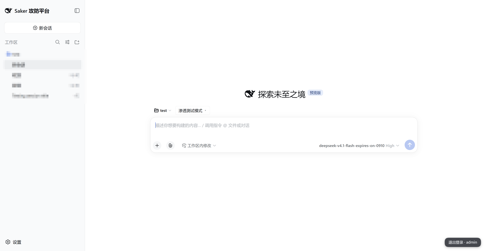

## 为什么会有Saker

DeepSeek Harness的设计哲学是「Everything is a Plugin」——模式、工具、界面、上下文注入，都能拆成独立bundle挂上去，互不干扰。但它只解决了组件怎么装，没回答方法由谁定义。

Saker补的是后半句：**万物皆可自定义**。

### 同类的插件，问题不在功能少

市面上能见到的「AI渗透测试插件」，绝大多数本质是一段写死的提示词。流程、话术、输出格式、工具选择全固化在文本里，装上去是什么样，用起来就永远是什么样。

于是你会遇到这些情况：

- 它的测试顺序不合你的方法论，但你改不了，只能迁就。
- 它内置的工具清单里没有你常用的那个，接不进去。
- 你想接自己的MCP服务，它不支持。
- 上一场战役摸清的指纹和打法，换个会话就忘了，下一场从零开始。
- 它说「已确认漏洞」，但你没有证据链，也不知道依据是什么。

说到底不是功能少，是它替你做了决定。

### Saker把「怎么测」从提示词里拿出来

具体到能改什么：

- **测试方法可以自己编排。** 26个内置方法只是起点，方法的组合、衔接、正文都能改，存成模板复用。
- **工具链可以是你的。** 本机扫描器、MCP服务、Claude Code / Codex CLI，接哪个、怎么接，由你决定。
- **覆盖口径按你的方法论定义。** 攻击面矩阵的列序就是你的方法论序，不是我们规定的。
- **打过的仗能留下来。** 战术、指纹、工具可用性、教训，跨会话可检索。

## 写在前面

**这是一个工具，不是一个平台。** Saker不提供扫描器、不卖额度、不连任何商业服务。它做的事只有一件：让DSH在安全测试这件事上有章法、有记录、有边界。工具、模型、目标环境，都得你自己准备。

**它只服务于授权范围内的测试。** 渗透测试、代码审计、本地靶场、自己的资产——这些是它的用途。获取授权是使用者的责任，Saker不会替你做，也不会帮你绕开。仓库里的WebShell管理、资产测绘组件同理：它们默认不该面向公网暴露管理端。

**它应该可读、可改、可拆。** 21个插件各自独立、各自有README，你可以只装需要的那几个。不喜欢某个实现，直接换掉，不需要fork整个项目。

**关于反馈。** Bug、功能建议、用法疑问，走 [GitHub Issues](https://github.com/ITroyeSivan/Saker/issues) 都可以。请附上dsh版本、Saker版本、具体细节等。你可以通过GitHub主页的公开联系方式找我。

**维护状态。** 目前还在快速迭代状态，会不定时适配DSH的最新版本，并修复问题、优化体验和性能。

## 它是怎么搭起来的

Saker建在 [DeepSeek Harness](https://github.com/deepseek-ai/deepseek-harness) 上，本身分成两层，可以整套装，也可以只装其中一部分。

**模式包 `dsh-saker`** 提供两种专业模式的persona、playbook和离线参考资料——这是「怎么测」的知识层。

**21个独立插件** 提供界面、工具接入、过程治理、成果记录和协作能力——这是「用什么测」的能力层。每个插件都是独立bundle，各有README，互不依赖。

知识层和能力层通过DSH的平面机制松耦合。模式只声明它需要什么（阶段门、工具就绪度、知识指针），插件负责提供；换掉任何一个插件，模式照常工作。你可以只装扫描器封装、不装WebShell管理，也可以用自己的插件替换掉我们写的任何一个。

按作业环节看，这21个插件分布在五个位置上：

| 位置 | 数量 | 在作业里扮演什么 |
|---|---|---|
| 界面与配置 | 6 | 开工前把工具路径、MCP服务、知识库、技能和方法编排一次性配好 |
| 工具 | 4 | 执行阶段的「手」：本机扫描器、Semgrep、资产平台、WebShell |
| 过程 | 5 | 每一步的护栏：阶段门、写入边界、高危拦截、上下文补充 |
| 记录 | 4 | 每一步的账本：覆盖状态、发现、调用过程、战役经验 |
| 协作 | 2 | 独立复核路径与会话状态面板 |

对应到「想改什么、改哪里」：

| 你想改的东西 | 改哪里 |
|---|---|
| 测试方法的组合与顺序 | 输入框「方法 ▾」直接切换，或「设置 → 方法编排」编辑 |
| 工具清单与分类 | 设置 → 安全配置，增删工具、自己划分类别 |
| 接哪个MCP服务 | 设置 → MCP工作台，stdio / streamable HTTP都行 |
| 模式的性格和底线 | 模式包的persona段，或整套换掉 `dsh-saker` |
| 作战手册的章节 | 模式包内playbook技能，按你的方法论重写 |
| 覆盖矩阵的列 | AttackAtlas，列序就是你的方法论序 |
| 知识库内容 | 用户层 `DSH_HOME/refs/` 同名覆盖，或整库导入自己的资料 |
| 界面组件 | 21个插件里任何一个都可以单独替换 |

改完重新打包安装即可生效，不用动dsh宿主。

会话里的一次完整作业，大致是这样流转的：


每个阶段都会在工具调用层留下可检查的事实：有日志、有台账、有产物，不只是模型说它做了。

## 功能

### 两种模式，各自有完整作业路径

| | 渗透测试 | 代码审计 |
|---|---|---|
| 输入 | 授权目标、资产、接口或抓包材料 | 本地源码、仓库或反编译产物 |
| 主线 | 侦查、枚举、验证、复核、报告 | 扫描对账、入口到危险操作的数据流、利用条件、修复 |
| 证据 | 请求/响应、工具输出、复现步骤 | 文件与行号、调用链、规则命中、动态验证结果 |
| 交付 | 漏洞位置、影响、测试过程与修复建议 | 代码位置、完整链路、利用前提与修复建议 |

两个模式各带独立persona、playbook和离线参考资料。安全方法不一次性塞满上下文，按当前任务读取相关内容，所以能长时间跑而不失真。

除这两个专业模式外，宿主内置的 `standard` 模式同样保留在模式选择器中，供日常办公等非安全会话使用（安全插件只在安全模式下生效）。需要放开更多宿主模式时，用环境变量 `SAKER_VISIBLE_PRESETS` 追加。


### 攻击面不再靠记忆

AttackAtlas按目标记录每个攻击面的状态。四种终态会点亮：已测有发现、已测未命中、不适用（附原因）、预算耗尽；未测的留作暗格。每个格子都能查到支撑它的记录，也可以从矩阵直接派发下一个任务。

- **按目标分账。** 覆盖终态、阶段带、攻击链拓扑各存一份，同一个格子对不同目标互不覆盖；顶部下拉切换目标，所有视图跟着换锚点。
- **链路拓扑自动成图。** 节点登记后自动连线，重大成果金框标记，支持多入口和「从会话生成」。
- **双击即派单。** 点主类、子项或阶段，自动携带目标锚定和对应知识手册进当前会话。
- **矩阵列序 = 你的方法论序。** 不是我们规定的顺序。

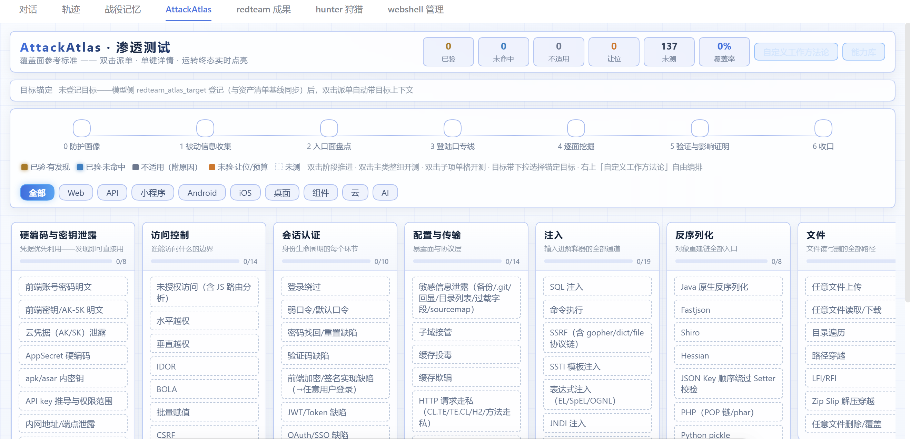

### 测试方法可以自己编排

这里有两层，一层管「方法本身怎么写」，一层管「这一轮用哪些」。

**方法内容（`dsh-method-stack`）**：内置26个方法，分五类——侦查5（端口扫描、目录枚举、指纹识别等）、利用14（SQL注入、XSS、SSRF、文件上传、命令注入、JWT、反序列化等）、内网3（凭据关系、横向入口、网段测绘）、证据2、报告2。每个方法就是一个目录，`manifest.yml` 写元信息、`prompt.md` 写正文。输入框上方的「方法 ▾」按钮直接勾选本轮启用哪些，变更下一轮生效；「设置 → 方法编排」可以克隆、改正文、存组合，用户层 `~/.dsh/method-stack/methods/` 同名目录直接覆盖官方内容，不用改包。

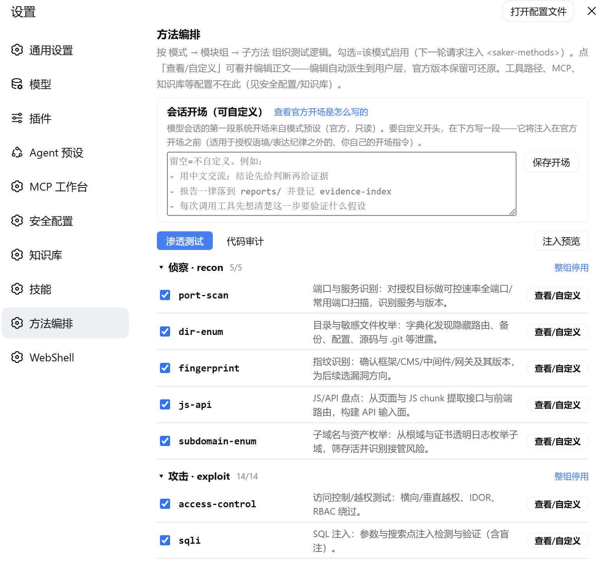

**方法衔接（AttackAtlas）**：主类、子项、工具、MCP服务、自定义工具模块在画布上自由接线，闭环五查（孤立、无起点、无终点、断裂、循环）以询问式确认；运行按分层派单进会话，逐项点亮矩阵。模板可编辑、复制、导入导出，编排草稿自动保存。

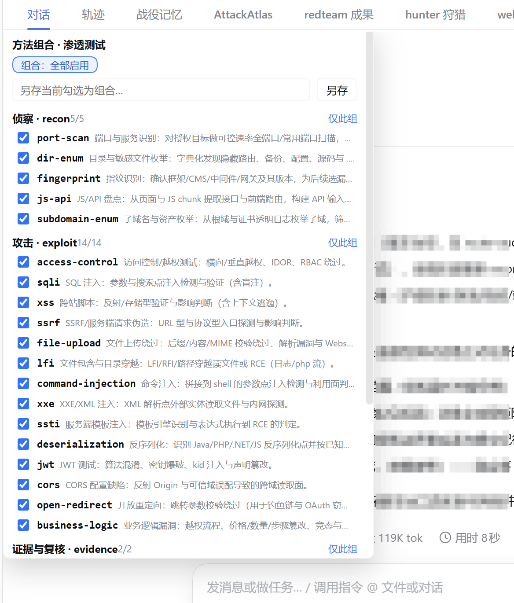

### 提示词、persona和技能都可以换

首屏说「连提示词也不例外」，分层是这样：

- **persona** 是模式的身份定义，在模式包内 `preset/pentest/agent.cordis.yml` 的persona段：身份、主观念（漏洞面）、铁律（验证等级、误报责任、高危操作门禁、负面清单）、表达纪律、委派方式。改它，等于换掉这个模式的性格和底线。
- **playbook** 是随模式走的作战手册技能，渗透862行、代码审计632行。它不常驻上下文，按当前任务读取相关章节，所以长会话里方法不会漂。
- **方法** 由 `dsh-method-stack` 管，启用哪些方法、正文怎么写，都在你的控制范围内（见上一节）。
- **共享技能** 目前6个：browser-recon（浏览器/网页交互作战）、web-fuzz（Web模糊测试）、independent-review（独立复核）、ecosystem-cooperation（生态协作）、red-team-command-doctrine（红队指挥条令）、redteam-boundary-policy（红队边界策略），两个模式都能引用。

这四层都在包里，改完重新打包安装即可生效。「设置 → 技能」列出共享、模式专属和已安装技能，支持上传zip/tgz安装到 `~/.dsh/skills` 并热载，用户层技能可卸载。面板提供一键复制引用串 `/<技能名>`：模型侧经 `skill` 工具按名加载，用户侧在输入框打 `/` 弹出候选，或直接贴 `/<技能名>` 注入当轮。

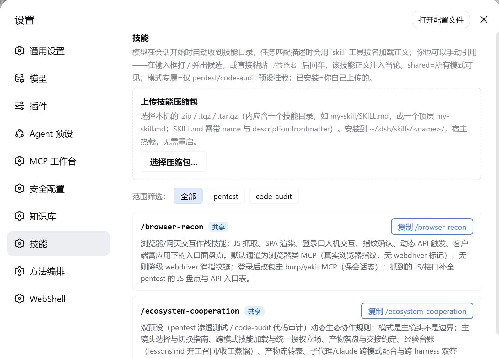

### 工具归工具，判断归判断

安全配置中心是本机工具的统一入口。内置18个工具预设，分六类：信息收集（subfinder、httpx、nmap）、漏洞扫描（nuclei、afrog）、目录与接口（dirsearch、katana、ffuf）、注入与利用（sqlmap）、令牌与认证（jwt_tool）、内网与横向（fscan、chisel、frp、impacket、ladon、kerbrute、mimikatz、BloodHound），也可以自己增删。

几个顺手的地方：

- **一键探测。** 指定一个或多个「工具根目录」，静默扫描并按分类导入候选；也可以手动粘贴单条路径。
- **配置直达模型。** 路径通过 `DSH_TOOL_<NAME>` 注入shell环境，模型运行时拿到的是你本机的真实工具；未配置时回退系统 `PATH`。
- **分类可自定义。** 内置六类之外可以自己增删分类。
- **服务端点自动桥接。** 填好Burp / Yakit地址保存即生效，Burp的legacy SSE接入由包内桥接脚本完成，不需要Java。

渗透模式提供nuclei、httpx、ffuf封装，代码审计模式提供本地Semgrep封装。扫描命中先进入待核对记录，不会直接写成已确认漏洞——这条纪律在工具层就定死了。

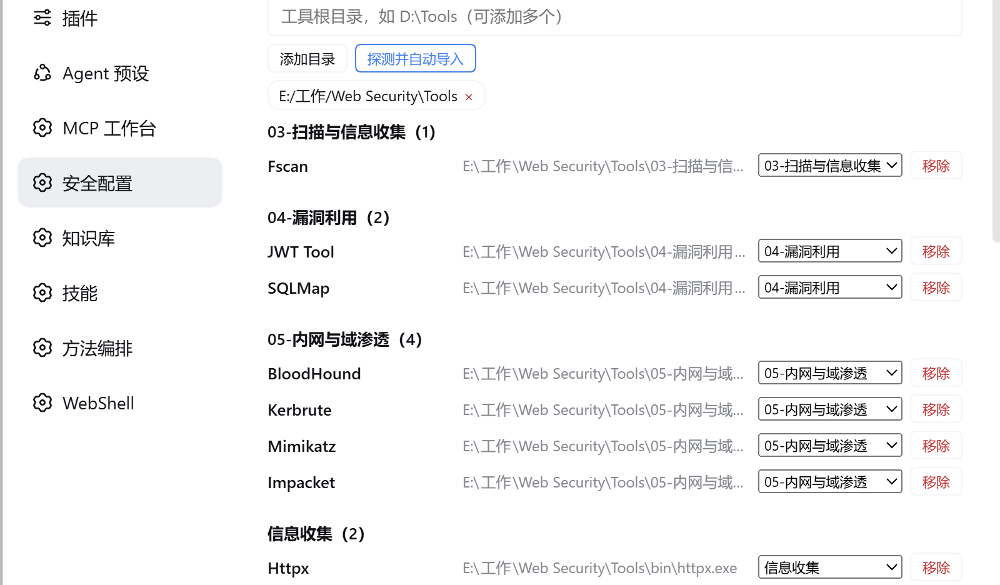

MCP Studio是MCP服务的单独工作台：支持stdio与streamable HTTP两种传输，可导入常见MCP JSON、查看真实连接状态与工具列表、执行握手诊断、查看调用记录。每个启用的服务由内置mcp-client桥接挂载，模型以 `mcp__<名称>__<工具>` 直接调用；编辑即热切换，禁用即卸载，全程无需重启。

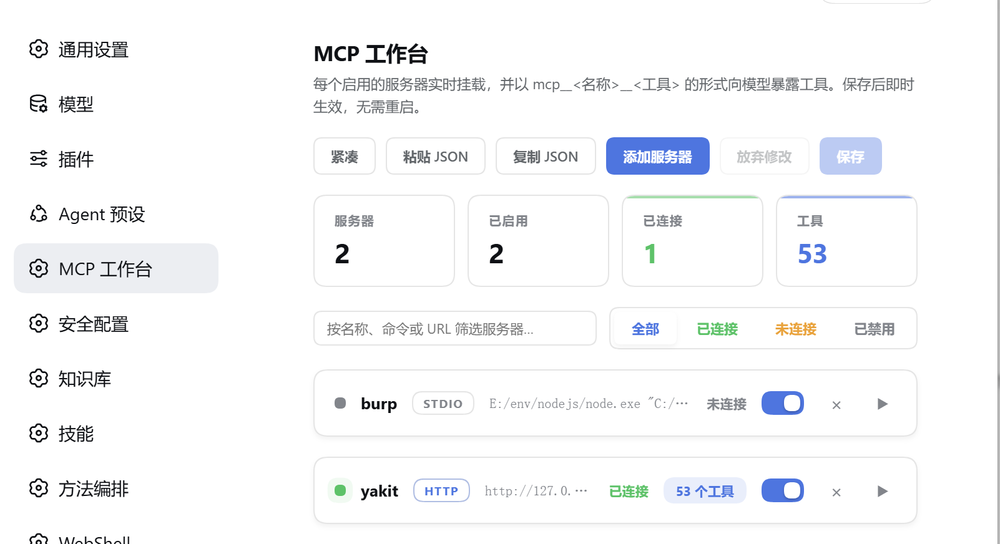

### 从「可能有问题」到「可以交付」

Redteam Results按会话保存发现，严格按「会话 × 模式」双键隔离。每条记录区分严重度、验证状态和证据等级，可展开查看测试过程、复现内容、证据引用和修复建议，按当前筛选或勾选项导出Markdown。跨会话还有聚合视图和全局任务台账大屏。

关键发现可以交给本机Claude Code或Codex CLI走第二路径复核；没有外部CLI时仍可用dsh原生子代理。复核状态回写成果台账。

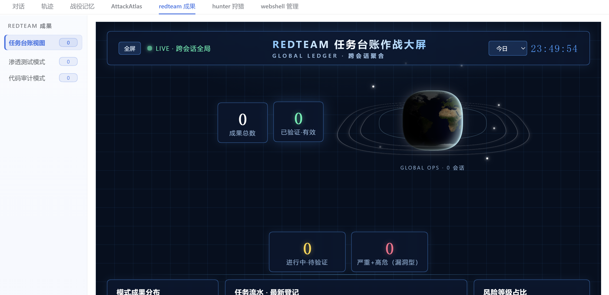

### 资产测绘与实测流水线

Hunter把FOFA、奇安信Hunter、360 Quake三家资产测绘聚合到一起：统一DSL一次编写，自动转写各平台语法，配额感知分页导出。

它还接了一条实测流水线：从成果库取finding → 指纹搜索 → 存活探测 → 分级验证 → 回写复测注记、证据与状态。分级是硬性的——互联网资产只做L0（GET首页加指纹核对），L1最小影响验证仅对用户显式标记授权的资产执行，不提供L2完整利用。

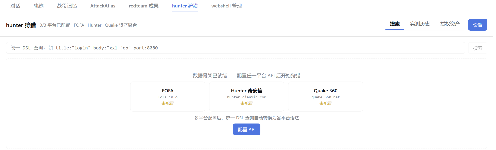

### WebShell管理

面向已授权环境的WebShell工作台，位于会话标签页：连接注册表、协议自动识别、命令执行、虚拟终端、文件管理（二进制安全传输、权限与时间戳处理、远程下载）、数据库控制台（PDO原生）、载荷生成器、声明式载荷插件体系。

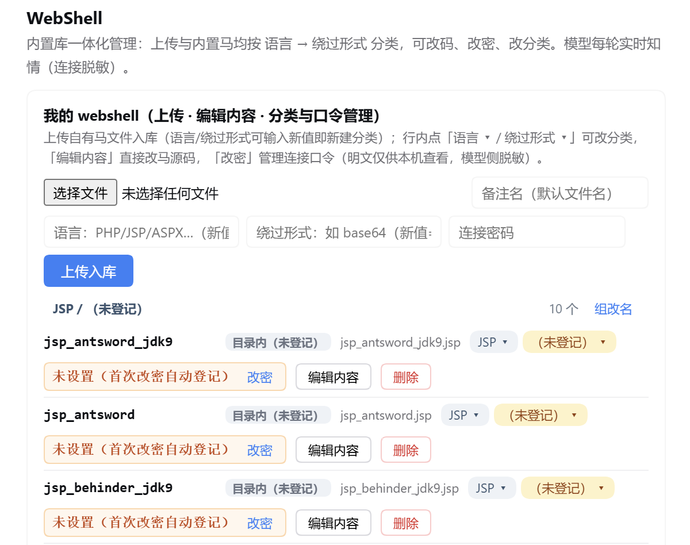

内置16种载荷生成形态，覆盖PHP、JSP、ASPX、ASP的基础、自研加密（v1/v2）与冰蝎/哥斯拉协议兼容变体，另含JSP内存马引导器。13件模型工具只在渗透测试模式下放行，所有操作入 `op_log` 台账；包内还带同核stdio MCP服务，可供外部harness接入。免杀变体不在生成器职责内，可「从文件导入」登记为产物。

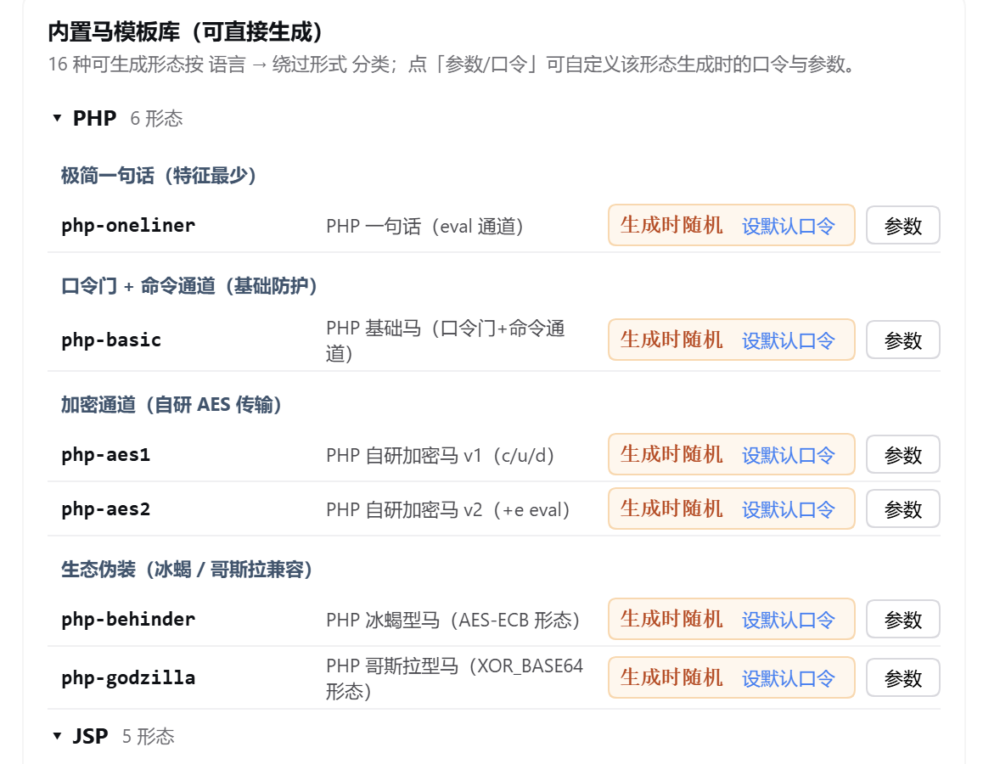

### 知识库随包，来源清晰可维护

离线资料随包即用：内置 [PayloadsAllTheThings](https://github.com/swisskyrepo/PayloadsAllTheThings) 全量文本快照（66个漏洞章节的README与payload清单，commit `3ac2790`，MIT），加上渗透（108篇）与代码审计（236篇）两套手册和Semgrep规则集，都不依赖外网。

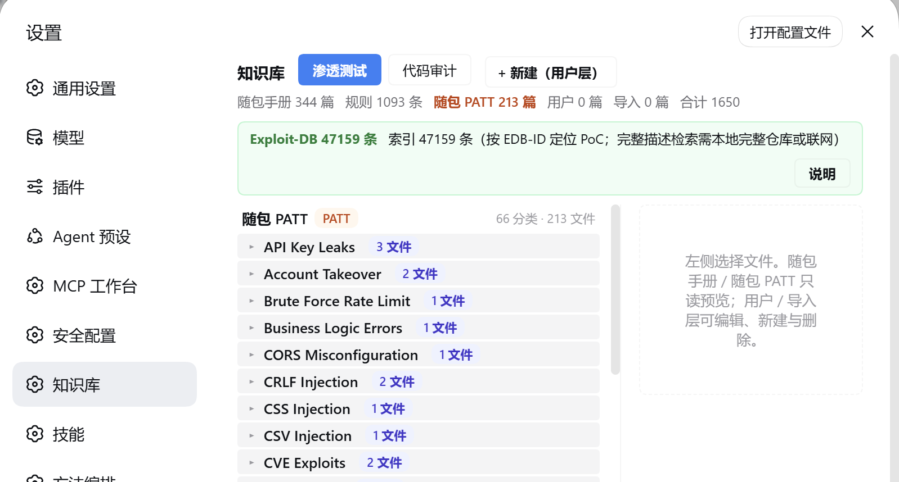

「设置 → 知识库」按来源和主题分类展示：随包PATT、随包手册、用户积累与导入源各自分组，每个分类带文件数徽章、可折叠展开。关键词检索先定位到文件与行号，再点开读原文。Exploit-DB的索引状态也在这里显示。

知识库是**分层可写**的：随包内容只读，用户层 `DSH_HOME/refs/` 同名文件覆盖包内（用户优先）；外部完整资产可以从Git仓库或本机文件夹整库导入到 `DSH_HOME/refs/imports/`，导入后完全离线可用。不同来源与许可证在目录内各有声明。

Exploit-DB不随包，走导入层。把官方仓库或元数据快照放到 `DSH_HOME/refs/imports/exploitdb/`，识别到 `files_exploits.csv` 就自动建字段化索引；也可以直接点设置页的「下载官方索引」，从gitlab.com抓 `files_exploits.csv` 与 `files_shellcodes.csv`（合计约30MB，含16列完整元数据：标题、作者、类型、平台、CVE codes）。索引就绪后检索命中形如 `[EDB-12345]`，PoC原文按需读 `exploitdb/<path>`。只下索引不拉源码仓库时，描述和定位检索照常，读原文需要目录里确实有对应文件。

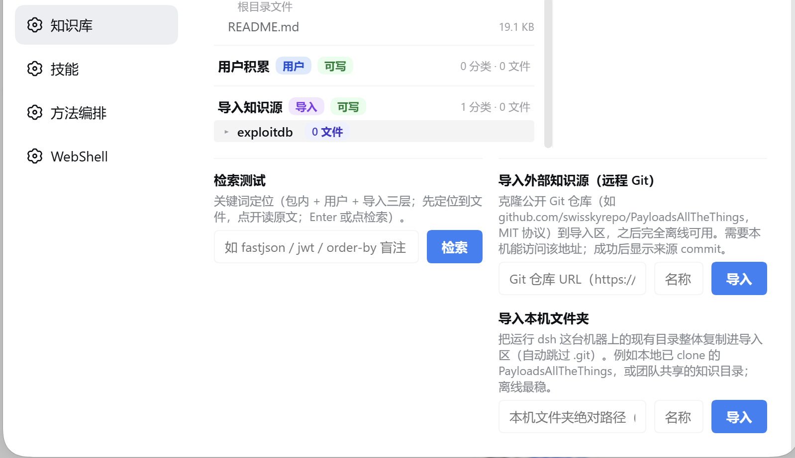

### 过程留痕与跨会话记忆

安全测试最怕两件事：跑了一半忘了做过什么，换个会话又得从头来。Saker用三个插件解决：

- **Trace Vault** 自动捕获每一次工具调用（参数、结果文本、耗时）落SQLite，跨compaction仍可检索。零行为改变，不拦截、不改写、不注入。
- **Campaign Memory** 把打过的仗变成可召回的打法资产：战术打法、目标指纹、工具可用性、教训、检测指纹五类。同题写入刷新而非重复，召回排序按使用热度加30天时间衰减——久未读取的自动让位，读取即复活。检测指纹默认30天过期（免杀情报半衰期），目标指纹180天。
- **Session Pulse** 是会话作战面板：任务进度chip、子代理目录抽屉、提示词栏（全部用户输入成列，点击定位到消息流）。

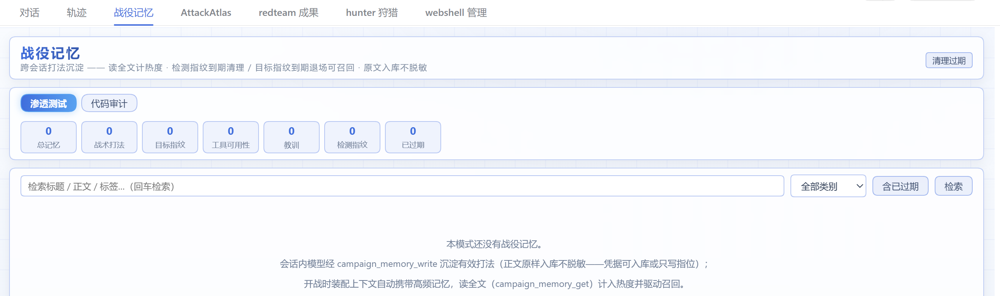

### 纪律由机器执行

纪律写在提示词里靠模型自觉不够，长会话压缩后临近性就丢了。Saker把几条关键约束做成工具调用层的硬门：

- **`dsh-sec-enforce`（确定性执行护栏）** 用dsh原生guard缝把纪律变成机器强制：报告门（写 `reports/` 前必须过阶段门）、写入边界、无速率控制的全端口扫描、高危命令特征（大范围删除、裸DROP、停机重启、资金类POST）等，外加意图门、约束门、审批层与急停开关。只对两个安全预设触发，每次拒绝写入 `enforce-log.md`。
- **`dsh-stage-gate`（阶段门）** 把结构检查变成模型工具 `stage_gate`——模型不能自评门禁，必须调用工具校验，判定追加进 `gate-log.md`。目标契约登记后可逐条met/failed/reopened，中断也能恢复。
- **`dsh-route-boost`（逐轮治理信封）** 每步装配时现场求值，按当前阶段补充门禁、证据和知识资料指针，信封里列出当前模式可引用的技能名与工具就绪度。
- **`dsh-refusal-guard`（拒答修复）** 检测异常拒答并触发有记录的升级梯修复流程。三级检测器：50条强短语（中英日韩俄法）、16条软拒答模式、22条弱关键词，弱关键词只在回答开头150字符内匹配，避免误伤正文里的正常表述。
- **`dsh-auto-advance`（自动推进）** 子代理返回后，若台账有未收口意图，注入推进提醒；只在存在未关闭意图时工作，有连续轮次上限，随时可接管。

### 新会话页

`dsh-mode-group` 把两种专业模式（pentest / code-audit）排在最前，其余可见模式（宿主 `standard`，供日常办公会话）紧随其后，避免模式一多选择区拥挤。纯客户端表面，不改宿主行为。

## 一次完整任务怎样推进

1. 在新会话选择 `pentest` 或 `code-audit`，写清目标、授权范围和限制。
2. Saker建立目标与任务台账，按模式拆解攻击面或审计链路。
3. Agent调用本机工具、MCP服务或子代理执行任务，过程和产物留在工作区。
4. 扫描命中进入待核对区；确认项补齐复现步骤、证据与影响说明。
5. 关键发现经独立路径复核，状态回写成果台账。
6. 阶段门检查必需产物；尚未收口的任务会阻止提前生成报告。

走完这六步，你手上会有可复现的证据、可追溯的台账，以及一份分得清哪些结论站得住、哪些还只是线索的报告。

## 快速开始

### 环境要求

- DeepSeek Harness已安装，`dsh web` 可以正常启动，并已配置可用模型。
- Node.js `>=22.5`。MCP Studio要求 `^22.19.0 || >=24.0.0`。
- 使用扫描器、Semgrep、Burp、Yakit、Claude Code或Codex时，需要自行安装并配置对应程序。

> 当前完整验证环境为 DeepSeek Harness **`0.1.5-rc.1-183f08e`** 内部 Web 版本。公开 npm 线 `@deepseek-ai/dsh@0.1.2-rc.1` 为 CLI-only，不在完整 Web 工作台的验证范围内。

**关于 `0.1.5-rc.1`**：已在真实宿主上完成适配并实跑验证。

需要特别说明的是——**这一版存在静态 API 差分看不出来的破坏性变更**，本项目最初的差分结论（「影响仅一处」）是**错的**，已被实跑推翻：

| 变更 | 说明 |
|---|---|
| `connection` 服务的 inject 收窄 | `["webServer", "credentials"]` → `["credentials"]` |
| 路由注册归属改为**调用方** | 需用 `owner.webServer`，不再是消费方 |

后果：沿用 `connection.rpc.handle(channel, handler)` 的插件会**静默注册失败且不抛错** ——
设置页永久「加载中…」、RPC 通道 404，日志里毫无线索。改用
`connection.register(ctx, channel, handler)` 并确保 inject 带 `webServer` 后恢复正常。

其余依赖面（`agentPresets` 契约、persona `prefix`、`skill-filesystem` 的 `customSkillDirs`、
`defineTool` 声明式契约、`conversation.hero.agentPreset` 槽位）经实跑确认未变；
宿主新增的 `dsh-tool-present` 已由 Saker 两个预设同步挂载。

**验收基线**：设置页 10/10 分区正常 · 插件 RPC 路由 12/12 已注册 · 插件加载失败 0 · 15 套测试 968 断言全绿。
详见 [docs/release-v0.2.5.md](docs/release-v0.2.5.md)。

### 从源码安装全部组件

```bash
git clone https://github.com/ITroyeSivan/Saker.git
cd Saker

# 生成根模式包和21个插件包
node scripts/pack-all.mjs

# 按顺序安装到web profile（自动跳过同版本、升级更高版本）
node scripts/install-all.mjs

# 重启宿主
dsh web
```

`pack-all.mjs` 需要 `pnpm` 可用。`install-all.mjs` 默认安装到 `web` profile，可用 `SAKER_PROFILE` 指定其他profile；`dsh` 不在PATH时用 `DSH_CLI` 指向CLI入口（例如源码树里的 `apps/cli/lib/bin.js`），`DSH_HOME` 可覆盖配置目录。脚本会跳过已安装的同版本包、自动升级更高版本，并清理因重新打包而失效的旧 `file:` 依赖，可安全重复执行。

启动后：

1. 在「设置 → 安全配置」填写需要使用的本机工具路径与服务地址。
2. 在MCP Studio导入或新增MCP服务。
3. 新建会话，选择 `pentest` 或 `code-audit`。

<details>
<summary><b>只安装部分组件</b></summary>

每个目录都是独立的dsh bundle。先安装根模式包，再按需要添加插件：

```powershell
dsh plugin --profile web add "file:C:/packages/dsh-saker-0.2.5.tgz"
dsh plugin --profile web add "file:C:/packages/dsh-external-dsh-sec-config-1.1.7.tgz"
dsh plugin --profile web add "file:C:/packages/dsh-external-dsh-knowledge-hub-0.1.10.tgz"
dsh plugin --profile web add "file:C:/packages/dsh-external-dsh-skill-browse-1.1.1.tgz"
dsh plugin --profile web add "file:C:/packages/dsh-external-dsh-stage-gate-1.5.0.tgz"
```

两个模式直接引用对应扫描插件。使用完整模式能力时一并安装：

```powershell
dsh plugin --profile web add "file:C:/packages/dsh-external-dsh-scanner-tools-1.0.0.tgz"
dsh plugin --profile web add "file:C:/packages/dsh-external-dsh-semgrep-audit-1.0.0.tgz"
```

</details>

<details>
<summary><b>更新与卸载</b></summary>

更新时重新打包并对需要升级的包执行 `dsh plugin add`，然后重启dsh。`install-all.mjs` 会跳过同版本项、升级更高版本，并先清理指向已删除tgz的旧依赖。

```powershell
dsh plugin --profile web add "file:C:/packages/dsh-saker-新版本.tgz"
dsh plugin --profile web remove dsh-saker
```

独立插件需要使用各自的包名管理。卸载包不会自动删除已经生成的会话、数据库和任务产物。

</details>

## 插件清单

Saker当前包含21个独立插件。多数用户不需要逐个理解；`pack-all` + `install-all` 会完成整套安装。

| 位置 | 插件 | 版本 | 做什么 |
|---|---|---|---|
| 界面与配置 | `dsh-mode-group` | 1.0.1 | 在新会话页集中展示安全模式 |
| 界面与配置 | `dsh-sec-config` | 1.1.10 | 管理工具路径、Burp/Yakit、DNSLog与改密入口（API Key由「平台设置」统一维护）；工具按分类呈现、支持指定根目录自动探测候选一键导入，可自定义与删除 |
| 界面与配置 | `dsh-mcp-studio` | 1.0.10 | 管理、诊断和预览MCP服务及工具 |
| 界面与配置 | `dsh-knowledge-hub` | 0.1.14 | 知识库管理：随包PATT与手册、用户积累、Git/本机文件夹导入；Exploit-DB字段化索引与一键下载；按主题分类浏览与检索 |
| 界面与配置 | `dsh-skill-browse` | 1.1.4 | 设置页「技能」：列出共享 / 模式专属 / 已安装技能；上传zip/tgz安装并热载、可卸载用户层技能；一键复制宿主引用串 |
| 界面与配置 | `dsh-method-stack` | 0.1.8 | 提示词模块化：26个内置测试方法可勾选、克隆、改正文、存组合；输入框「方法 ▾」直接切换 |
| 工具 | `dsh-scanner-tools` | 1.0.1 | 将nuclei、httpx、ffuf封装为模型工具 |
| 工具 | `dsh-semgrep-audit` | 1.0.1 | 使用本地Semgrep和随包规则集进行代码扫描 |
| 工具 | `dsh-hunter` | 1.0.0 | 聚合FOFA、Hunter、Quake资产检索与分级实测 |
| 工具 | `dsh-webshell-mgr` | 1.1.15 | 管理已授权环境中的连接、文件和数据库操作；内置16种载荷生成形态 |
| 过程 | `dsh-stage-gate` | 1.5.0 | 记录目标与意图，检查阶段产物是否齐全 |
| 过程 | `dsh-sec-enforce` | 1.4.1 | 在工具执行前约束写入范围、报告门和高风险操作 |
| 过程 | `dsh-route-boost` | 1.3.5 | 按当前阶段补充门禁、证据和知识资料指针；信封列出可引用技能名与工具就绪度 |
| 过程 | `dsh-auto-advance` | 0.3.2 | 子代理返回后，在有限轮次内推进尚未收口的任务 |
| 过程 | `dsh-refusal-guard` | 1.0.0 | 识别异常拒答并触发有记录的纠偏流程 |
| 记录 | `dsh-redteam-results` | 1.0.2 | 保存发现、复核状态并导出Markdown |
| 记录 | `dsh-attack-atlas` | 1.2.1 | 按目标记录攻击面覆盖和攻击链 |
| 记录 | `dsh-trace-vault` | 0.3.0 | 将工具调用和结果写入可检索的过程库 |
| 记录 | `dsh-campaign-memory` | 1.1.2 | 保存可跨会话检索的战役信息 |
| 协作 | `dsh-product-subagents` | 1.1.0 | 接入本机Claude Code、Codex CLI子代理 |
| 协作 | `dsh-session-pulse` | 0.1.0 | 展示任务进度、子代理和历史用户指令 |

每个插件目录都有独立README，说明配置、边界和验证方式。完整目录见 [`plugins/`](./plugins/)。

<details>
<summary><b>结果可信与执行约束</b></summary>

- 扫描命中只表示待核对线索；确认漏洞需要补充复现过程和证据。
- `dsh-stage-gate` 检查文件、标记和表格等可机器判断的阶段产物；语义正确性仍由复核者判断。
- `dsh-sec-enforce` 限制任务工作区外写入、无速率控制的全端口扫描，以及命中任务约束的命令和请求。部分可逆高风险操作进入宿主审批。
- `dsh-product-subagents` 提供不同执行后端的复核路径，但是否独立、是否具备所需上下文，仍取决于你的模型与CLI配置。
- `dsh-auto-advance` 只在存在未关闭意图时工作，有连续轮次上限，用户可以随时接管。

</details>

<details>
<summary><b>离线资料与第三方规则</b></summary>

- 渗透测试资料索引当前记录108篇。
- 代码审计资料索引当前记录236篇Markdown，并包含自建及第三方Semgrep规则（自建Java 402条 / 开源快照1096条）。
- 内置 [PayloadsAllTheThings](https://github.com/swisskyrepo/PayloadsAllTheThings) 全量文本（66个漏洞章节的README与payload清单，commit `3ac2790`，MIT），随包离线可用；与其余资料一起在「设置 → 知识库」按主题分类浏览、检索。
- Exploit-DB不随包：放到 `DSH_HOME/refs/imports/exploitdb/` 即建字段化索引，或在设置页一键下载官方索引（约30MB，需可访问gitlab.com）。索引命中形如 `[EDB-12345]`。
- Semgrep OSS快照、自建规则和其他资料具有不同许可，数量与来源以各目录README为准。

Saker自有代码采用MIT License；随附第三方资料不自动转为MIT。再分发前请阅读 [THIRD_PARTY_NOTICES.md](./THIRD_PARTY_NOTICES.md)。

</details>

## 项目结构

```text
Saker/
├── preset/
│   ├── pentest/                  # 渗透测试模式：persona、playbook、参考资料
│   ├── code-audit/               # 代码审计模式：persona、playbook、规则集
│   └── shared/refs/              # 随包PayloadsAllTheThings快照（MIT）
├── shared/
│   ├── skills/                   # 两种模式共享的协作与复核技能（6个）
│   ├── refs/                     # 共享参考资料
│   └── scripts/                  # 工具面辅助脚本
├── plugins/                      # 21个独立功能插件
├── scripts/                      # 全量打包（pack-all）与安装（install-all）
├── lib/preset-root.js            # 模式注册入口
├── cordis.patch.yml              # bundle加载配置
├── docs/images/                  # README 截图（15 张）与截图清单
├── core-patches/                 # 可选的宿主品牌与鉴权改动说明
└── THIRD_PARTY_NOTICES.md        # 第三方内容许可声明
```

`dsh-saker` 根包的发布文件不包含 `plugins/` 和 `core-patches/`。Saker可直接使用；不应用可选宿主补丁时，界面保留dsh原有品牌和登录行为。

## 当前边界

- 面向已获授权的安全测试、代码审计和本地实验，不负责获取测试授权。
- Saker不附带商业扫描器、本机CLI、模型服务或第三方平台额度。
- 扫描结果和模型结论都可能误判；涉及真实系统的处置应由安全人员复核。
- 本地配置和任务产物可能含API Key、Token、请求报文及源码信息。公开日志和截图前务必脱敏，不要提交个人 `.dsh` 目录。
- 仓库内的WebShell管理与资产搜索组件仅适用于明确授权范围，默认不应面向公网暴露管理端。

## Roadmap

- 可配置的HTML / PDF报告模板
- 多目标协作会话的拓扑视图
- 攻击面覆盖报告自动导出
- 更完整的公开版DeepSeek Harness兼容性验证

## 联系与反馈

- 作者：[@ITroyeSivan](https://github.com/ITroyeSivan)
- Bug、功能建议、用法疑问：[GitHub Issues](https://github.com/ITroyeSivan/Saker/issues)
- 其它反馈：通过GitHub个人主页公开的邮件联系。

## License

Saker自有代码采用 [MIT License](./LICENSE)，Copyright © 2026 Saker contributors。

第三方规则与资料沿用各自许可，详见 [THIRD_PARTY_NOTICES.md](./THIRD_PARTY_NOTICES.md)。

## 致谢

- [DeepSeek Harness](https://github.com/deepseek-ai/deepseek-harness) — 宿主与Agent基础能力。
- [dsh-pentest](https://github.com/howmp/dsh-pentest) — 模式包和增量安装方式参考。
- [ARTEX](https://github.com/Autumn-27/ARTEX) — 安全Agent方法论参考。
- 所有被引用知识资料、检测规则和安全工具的维护者。
