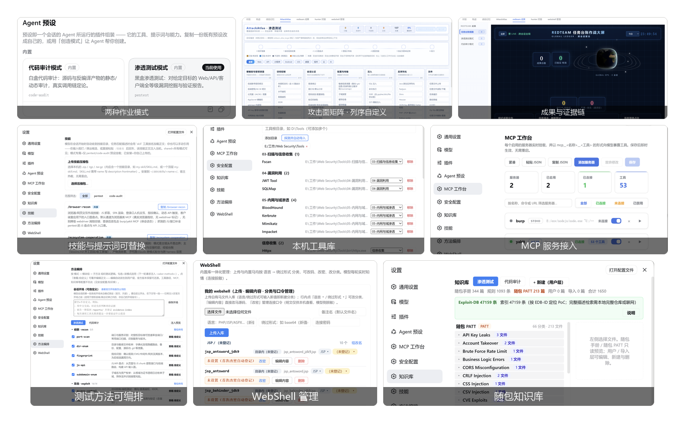

<div align="center">

# Saker

**给 DeepSeek Harness 用的安全测试工作台：渗透测试与代码审计的流程、工具、留痕都可替换。**

模块化提示词 · 21 个独立插件 · 自定义工具链 · MCP 接入 · 安全知识库 · WebShell 管理

[](https://github.com/deepseek-ai/deepseek-harness)
[](https://github.com/ITroyeSivan/Saker)
[](./package.json)
[](./LICENSE)

</div>



## 这是什么

Saker 是 DeepSeek Harness 上的一套安全测试模式包，外加 21 个独立插件。
它不提供扫描器、模型或额度，负责的是「怎么测」这件事：测试流程、攻击面口径、工具接入、过程留痕、成果复核。

跟常见的「AI 渗透测试插件」不同，那些本质是一段写死的提示词——流程、话术、输出格式、工具选择全固化在文本里，装上去是什么样，用起来就永远是什么样。
Saker 把这些都做成能自己改的：26 个内置提示词能自由组合、自由修改，工具和 MCP 接哪个由你定，技能可以自己装，模式包（persona / playbook）也能整套换掉。

## 特性

- **三种模式** — 渗透测试、代码审计两个专业模式，外加宿主自带的标准模式，在新会话页直接切
- **提示词可编排** — 26 个内置提示词能勾选、改内容、存成组合，输入框「方法 ▾」一键切
- **技能可自定义** — 技能包能上传安装、能卸载，会话里按需引用
- **工具可自定义** — 本机扫描器的路径和分类自己配，库里没有的工具也能加进来
- **MCP 可接入** — stdio 和 streamable HTTP 两种接法，连上就能给模型用
- **攻击面覆盖** — 每个资产测到哪一步都落库，没测的地方一眼看得见
- **WebShell 管理** — 16 种载荷生成、连接与文件/数据库操作，库按语言和绕过方式分类
- **知识库随包** — PayloadsAllTheThings 全量文本、方法论手册、Exploit-DB 索引，离线可用
- **成果与证据** — 每个发现都挂证据和复核状态，报告从台账生成，不是模型现场编
- **跨会话记忆** — 打过的目标、指纹、工具经验都留着，下个会话能查

## 快速开始

### 环境要求

- DeepSeek Harness 已安装，`dsh web` 能正常启动，并已配置可用模型
- Node.js `>= 22.5`（MCP Studio 要求 `^22.19.0 || >= 24.0.0`）
- 用扫描器、Semgrep、Burp、Yakit时，需自行安装并配置

### 安装

```bash
git clone https://github.com/ITroyeSivan/Saker.git
cd Saker

node scripts/pack-all.mjs        # 生成根模式包和 21 个插件包
node scripts/install-all.mjs     # 装进 dsh 的 web profile
dsh web                          # 重启宿主
```

`install-all.mjs` 会跳过已是最新的包、升级更高版本，可安全重复执行。

### 确认装好了

进入「设置」，依次点开安全配置 / MCP 工作台 / 知识库 / 技能 / 方法编排 / WebShell，六个面板都应正常加载。
新建会话选择 `pentest` 模式，输入框上方会出现「方法 ▾」入口。

工具探测、MCP 地址、DNSLog 等首次配置见 [安装与首次配置](./docs/getting-started.md)。

## 后续计划

- [ ] 持续适配 DeepSeek Harness 最新版本（当前支持：`0.1.5-rc.1`）

- [ ] 新增功能

- [ ] 性能优化，兼顾高可自定义特性和模型效果

- [ ] Bug修复

  

| 你想做什么 | 看哪篇 |
|---|---|
| 装起来、跑通第一个任务 | [安装与首次配置](./docs/getting-started.md) |
| 搞清楚每个功能在哪、怎么改成自己的 | [功能说明](./docs/features.md) |
| 了解整体设计与插件分工 | [架构：它是怎么搭起来的](./docs/architecture.md) |
| 查某个插件是干什么的 | [插件清单](./docs/plugin-list.md) |
| 改代码、打包、发版 | [开发与发布](./docs/development.md) |
| 确认能用在哪、哪些结论要人复核 | [边界与执行约束](./docs/boundaries.md) |
| 看这一版改了什么 | [发布说明](./docs/release-v0.2.6.md) |

## 边界与授权

Saker 面向**已获授权**的安全测试、代码审计和本地实验，不负责获取授权。
扫描结果和模型结论都可能误判，涉及真实系统的处置应由安全人员复核。

本地配置与任务产物可能含 API Key、Token、请求报文和源码，公开日志或截图前务必脱敏，不要提交个人的 `.dsh` 目录。
仓库内的 WebShell 管理与资产检索组件仅适用于明确授权范围，默认不应把管理端暴露到公网。

## 反馈与许可

- Bug、功能建议、用法疑问：[GitHub Issues](https://github.com/ITroyeSivan/Saker/issues)（请附 dsh 版本、Saker 版本和复现步骤）
- 作者：[@ITroyeSivan](https://github.com/ITroyeSivan)
- 项目仍在快速迭代，会不定时适配 DSH 最新版本、修问题、优化性能

Saker 自有代码采用 [MIT License](./LICENSE)。随附第三方资料不自动转为 MIT，再分发前请读 [THIRD_PARTY_NOTICES.md](./THIRD_PARTY_NOTICES.md)。

致谢 [DeepSeek Harness](https://github.com/deepseek-ai/deepseek-harness)、[dsh-pentest](https://github.com/howmp/dsh-pentest)、[ARTEX](https://github.com/Autumn-27/ARTEX)，以及所有被引用的知识资料、检测规则与安全工具的维护者。
