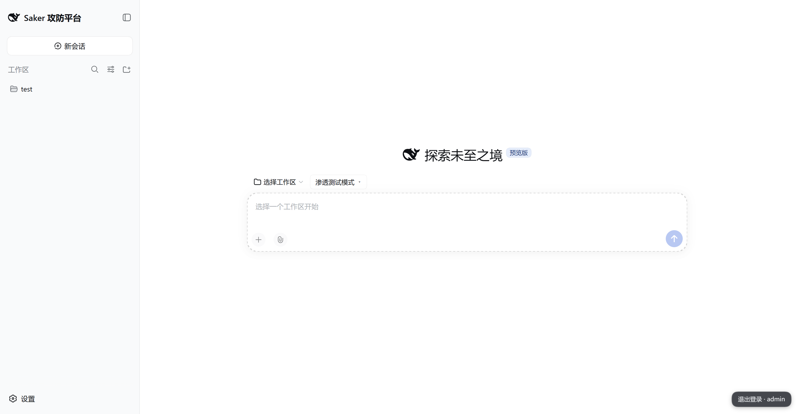
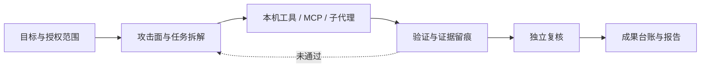
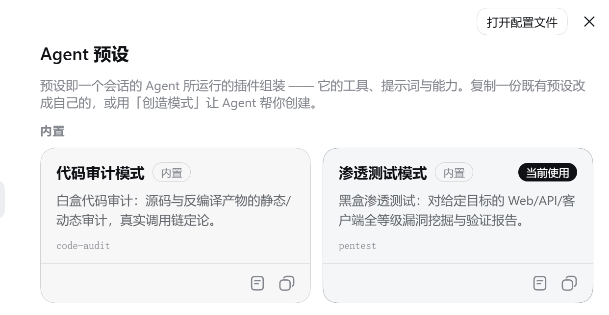
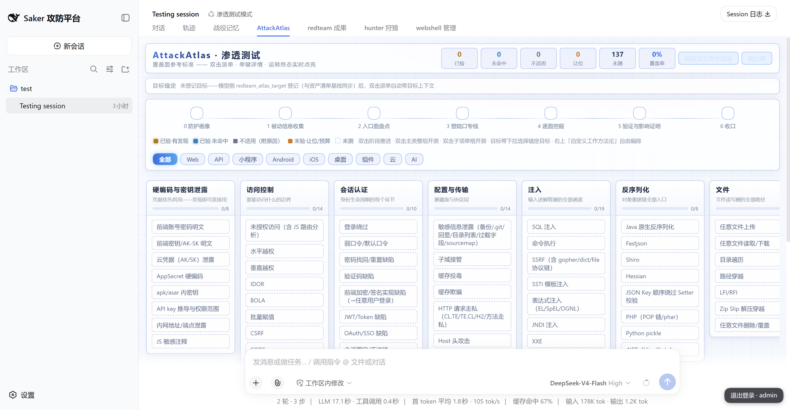
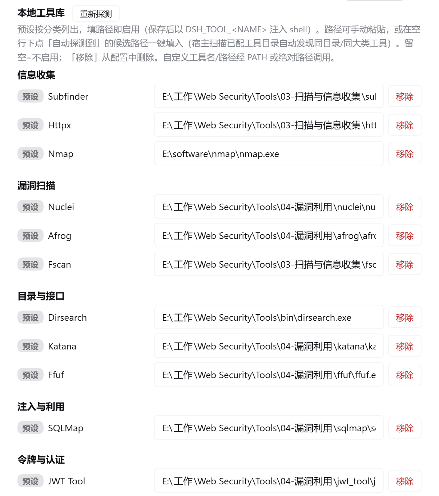
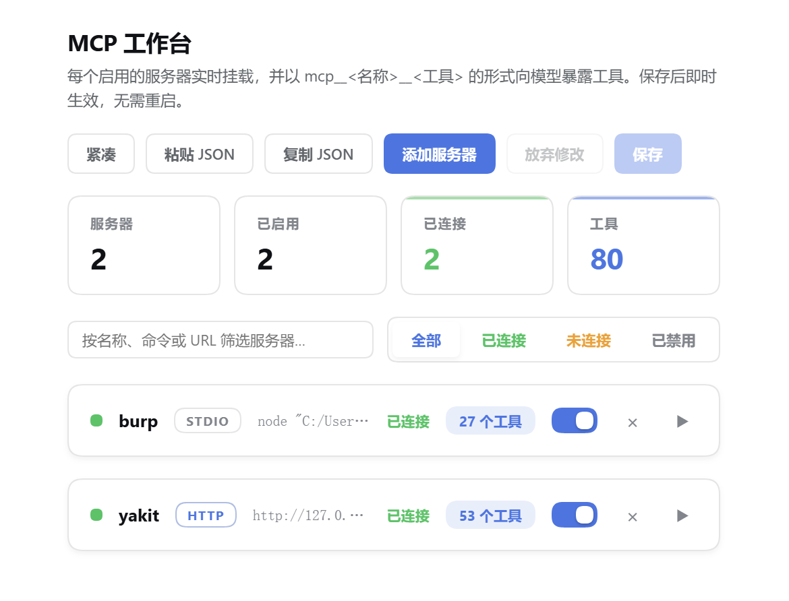
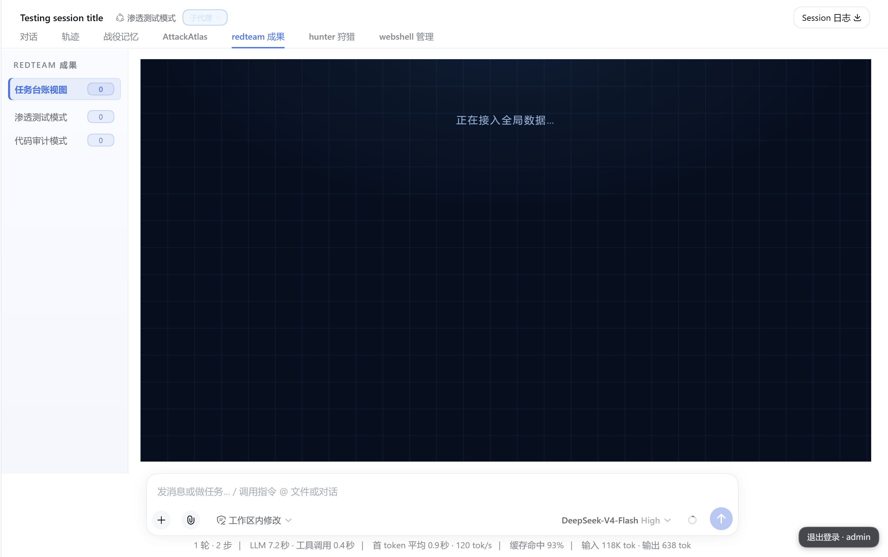
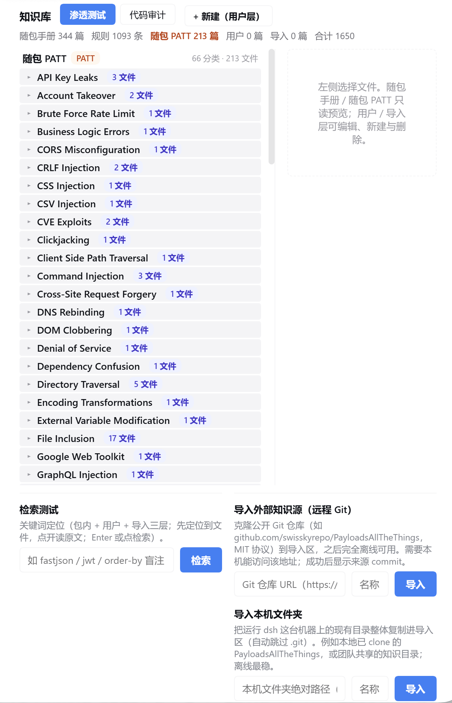

<div align="center">

# Saker

### 会调用工具，不等于会做安全测试。

**Saker 为 DeepSeek Harness 补上从范围确认、测试推进、证据复核到报告交付的完整工作流。**

渗透测试 · 代码审计 · 攻击面管理 · MCP 工具接入 · 多 Agent 复核 · 成果沉淀

[快速开始](#快速开始) · [看看它能做什么](#看看它能做什么) · [插件清单](#插件清单) · [联系与反馈](#联系与反馈)

[](https://github.com/deepseek-ai/deepseek-harness)
[](https://github.com/ITroyeSivan/Saker)
[](./package.json)
[](./LICENSE)

</div>


## Saker 是什么

Saker 是一套安装在 [DeepSeek Harness](https://github.com/deepseek-ai/deepseek-harness) 上的安全测试模式与插件集合。它提供 **渗透测试**、**代码审计** 两种专业模式，并把本机扫描器、MCP 服务、子代理、攻击面台账和漏洞成果串进同一个会话。

Saker 与扫描器配合使用，负责更难处理的部分：固定测试范围，规划下一步，验证命中，保存证据，组织复核，并形成可追溯的交付结果。



## 看看它能做什么

### 两种模式，各自有完整作业路径

| | 渗透测试 | 代码审计 |
|---|---|---|
| 输入 | 授权目标、资产、接口或抓包材料 | 本地源码、仓库或反编译产物 |
| 主线 | 侦查、枚举、验证、复核、报告 | 扫描对账、入口到危险操作的数据流、利用条件、修复 |
| 证据 | 请求/响应、工具输出、复现步骤 | 文件与行号、调用链、规则命中、动态验证结果 |
| 交付 | 漏洞位置、影响、测试过程与修复建议 | 代码位置、完整链路、利用前提与修复建议 |

两个模式各带独立 persona、playbook 和离线参考资料。安全方法不会一次性塞满上下文，而是按当前任务读取相关内容。


### 攻击面不再靠记忆

AttackAtlas 按目标记录每个攻击面的状态：已测有发现、已测未命中、不适用、预算耗尽或尚未测试。你可以打开格子查看依据，也可以从矩阵继续派发任务。

对于重复使用的测试流程，还可以把主类、子项、工具和 MCP 服务编排成方法模板，检查断链、孤立节点和循环后再运行。



### 工具归工具，判断归判断

安全配置中心统一管理本机工具路径和服务地址。当前可配置 sqlmap、nuclei、dirsearch、fscan、subfinder、httpx、katana、afrog、ffuf、jwt_tool、nmap；配置页会自动扫描已配工具所在目录，把同目录/同大类的工具路径列成候选，点一下即可填入，也可手动粘贴；模型运行时通过 `DSH_TOOL_<NAME>` 找到你本机的真实工具，未配置时回退到系统 `PATH`。

渗透模式提供 nuclei、httpx、ffuf 封装，代码审计模式提供本地 Semgrep 封装。扫描命中先进入待核对记录，不会直接写成已确认漏洞。

MCP Studio 支持 stdio 和 streamable HTTP 服务，可导入常见 MCP JSON、查看连接状态与工具列表、执行握手诊断并查看调用记录。Burp 的 legacy SSE 接入由安全配置插件内置桥接，Yakit 可通过 MCP 地址接入。






### 从“可能有问题”到“可以交付”

Redteam Results 按会话保存发现，区分严重度、验证状态和证据等级。每条记录可以展开查看测试过程、复现内容、证据引用和修复建议，并按当前筛选或勾选项导出 Markdown。

关键发现可以交给本机 Claude Code 或 Codex CLI 进行第二路径复核；没有外部 CLI 时仍可使用 dsh 原生子代理。工具调用过程由 Trace Vault 记录，长任务的目标、待办与阶段状态可以跨上下文恢复。



### 知识库随包，来源清晰可维护

离线资料随包即用：内置 [PayloadsAllTheThings](https://github.com/swisskyrepo/PayloadsAllTheThings) 全量文本快照（66 个漏洞章节的 README 与 payload 清单，commit `3ac2790`，MIT），加上渗透与代码审计两套手册和 Semgrep 规则，都不依赖外网。

“设置 → 知识库”按来源和主题分类展示这些资料：随包 PATT、随包手册、用户积累与导入源各自分组，每个分类带文件数徽章、可折叠展开。关键词检索先定位到文件与行号，再点开读原文；文档可以存放在用户层持续修订，也可以从 Git 仓库或本机文件夹整库导入（离线后仍可检索）。不同来源与许可证在目录内各有声明。

## 一次完整任务怎样推进

1. 在新会话选择 `pentest` 或 `code-audit`，写清目标、授权范围和限制。
2. Saker 建立目标与任务台账，按模式拆解攻击面或审计链路。
3. Agent 调用本机工具、MCP 服务或子代理执行任务，过程和产物留在工作区。
4. 扫描命中进入待核对区；确认项补齐复现步骤、证据与影响说明。
5. 关键发现经独立路径复核，状态回写成果台账。
6. 阶段门检查必需产物；尚未收口的任务会阻止提前生成报告。

每个阶段都会留下可检查的事实，后续任务和最终报告都以这些记录为依据。

## 快速开始

### 环境要求

- DeepSeek Harness 已安装，`dsh web` 可以正常启动，并已配置可用模型。
- Node.js `>=22.5`。MCP Studio 要求 `^22.19.0 || >=24.0.0`。
- 使用扫描器、Semgrep、Burp、Yakit、Claude Code 或 Codex 时，需要自行安装并配置对应程序。

> 当前完整验证环境为 DeepSeek Harness `0.1.3-alpha.1` 内部 Web 版本。公开 npm 线 `@deepseek-ai/dsh@0.1.2-rc.1` 为 CLI-only，不在完整 Web 工作台的验证范围内。

### 从源码安装全部组件

```bash
git clone https://github.com/ITroyeSivan/Saker.git
cd Saker

# 生成根模式包和 20 个插件包
node scripts/pack-all.mjs

# 按顺序安装到 web profile
node scripts/install-all.mjs

# 重启宿主
dsh web
```

`pack-all.mjs` 需要 `pnpm` 可用。`install-all.mjs` 默认安装到 `web` profile；自定义 profile 时设置 `SAKER_PROFILE`。脚本跳过已安装的同版本包，仓库内包版本更高时自动升级，适合首次安装、补装与升级。

启动后：

1. 在“设置 → 安全配置”填写需要使用的本机工具路径与服务地址。
2. 在 MCP Studio 导入或新增 MCP 服务。
3. 新建会话，选择 `pentest` 或 `code-audit`。

<details>
<summary><b>只安装部分组件</b></summary>

每个目录都是独立的 dsh bundle。先安装根模式包，再按需要添加插件：

```powershell
dsh plugin --profile web add "file:C:/packages/dsh-saker-0.2.2.tgz"
dsh plugin --profile web add "file:C:/packages/dsh-external-dsh-sec-config-1.0.12.tgz"
dsh plugin --profile web add "file:C:/packages/dsh-external-dsh-knowledge-hub-0.1.5.tgz"
dsh plugin --profile web add "file:C:/packages/dsh-external-dsh-skill-browse-1.1.1.tgz"
dsh plugin --profile web add "file:C:/packages/dsh-external-dsh-stage-gate-1.5.0.tgz"
```

两个模式直接引用对应扫描插件。使用完整模式能力时一并安装：

```powershell
dsh plugin --profile web add "file:C:/packages/dsh-external-dsh-scanner-tools-1.0.0.tgz"
dsh plugin --profile web add "file:C:/packages/dsh-external-dsh-semgrep-audit-1.0.0.tgz"
```

</details>

<details>
<summary><b>安装 Release 资产</b></summary>

发布 Release 后，可以直接安装对应 `.tgz`：

```powershell
dsh plugin --profile web add "https://github.com/ITroyeSivan/Saker/releases/download/v0.2.2/dsh-saker-0.2.2.tgz"
```

根包只包含两种模式、共享技能和参考资料。可视化页面、工具连接和治理能力位于独立插件包中，需要按 Release 资产清单分别安装。

</details>

<details>
<summary><b>更新与卸载</b></summary>

更新时重新打包并对需要升级的包执行 `dsh plugin add`，然后重启 dsh。`install-all.mjs` 会跳过同版本项，仓库包版本更高时自动升级。

```powershell
dsh plugin --profile web add "file:C:/packages/dsh-saker-新版本.tgz"
dsh plugin --profile web remove dsh-saker
```

独立插件需要使用各自的包名管理。卸载包不会自动删除已经生成的会话、数据库和任务产物。

</details>

### 第一条任务

```text
目标：http://127.0.0.1:8080，本地授权测试环境。
范围：仅测试该应用，不访问其他主机；不执行压测或破坏性操作。
任务：检查登录与接口访问控制，优先使用只读验证。
交付：区分已确认、待验证和误报；记录请求/响应证据，并给出具体修复建议。
```

代码审计示例：

```text
源码：C:/work/demo-app。
任务：追踪外部输入到命令执行、模板渲染和文件写入的调用链。
要求：列出文件、行号、入口、关键调用和利用前提；不要修改源码。
没有运行环境时注明验证限制，不把静态候选写成已动态复现。
```

## 插件清单

Saker 当前包含 20 个独立插件。多数用户不需要逐个理解它们；`pack-all` + `install-all` 会完成整套安装。

| 模块 | 插件 | 做什么 |
|---|---|---|
| 界面与配置 | `dsh-mode-group` | 在新会话页集中展示安全模式 |
| 界面与配置 | `dsh-sec-config` | 管理工具路径、Burp/Yakit、DNSLog 与改密入口（API Key 由「平台设置」统一维护）；工具按分类呈现、支持自动探测候选路径一键填入，可自定义与删除 |
| 界面与配置 | `dsh-mcp-studio` | 管理、诊断和预览 MCP 服务及工具 |
| 界面与配置 | `dsh-knowledge-hub` | 知识库管理：随包 PATT 与手册、用户积累、Git/本机文件夹导入；按主题分类浏览与检索 |
| 界面与配置 | `dsh-skill-browse` | 设置页「技能」：列出共享 / 模式专属 / 已安装技能；上传 zip/tgz 安装到 `~/.dsh/skills` 并热载、可卸载用户层技能；一键复制宿主引用串 `/技能名`（模型侧经 `skill` 工具加载，用户侧输入框打 `/` 或直接贴 `/name` 注入正文） |
| 工具 | `dsh-scanner-tools` | 将 nuclei、httpx、ffuf 封装为模型工具 |
| 工具 | `dsh-semgrep-audit` | 使用本地 Semgrep 和随包规则集进行代码扫描 |
| 工具 | `dsh-hunter` | 聚合 FOFA、Hunter、Quake 资产检索 |
| 工具 | `dsh-webshell-mgr` | 管理已授权环境中的连接、文件和数据库操作 |
| 过程 | `dsh-stage-gate` | 记录目标与意图，检查阶段产物是否齐全 |
| 过程 | `dsh-sec-enforce` | 在工具执行前约束写入范围、报告门和高风险操作 |
| 过程 | `dsh-route-boost` | 按当前阶段补充门禁、证据和知识资料指针；信封列出当前模式可引用技能名 |
| 过程 | `dsh-auto-advance` | 子代理返回后，在有限轮次内推进尚未收口的任务；试水消息不触发开工提醒 |
| 过程 | `dsh-refusal-guard` | 识别异常拒答并触发有记录的纠偏流程 |
| 记录 | `dsh-redteam-results` | 保存发现、复核状态并导出 Markdown |
| 记录 | `dsh-attack-atlas` | 按目标记录攻击面覆盖和攻击链 |
| 记录 | `dsh-trace-vault` | 将工具调用和结果写入可检索的过程库 |
| 记录 | `dsh-campaign-memory` | 保存可跨会话检索的战役信息 |
| 协作 | `dsh-product-subagents` | 接入本机 Claude Code、Codex CLI 子代理 |
| 协作 | `dsh-session-pulse` | 展示任务进度、子代理和历史用户指令 |

每个插件目录都提供独立 README，说明配置、边界和验证方式。完整目录见 [`plugins/`](./plugins/)。

<details>
<summary><b>结果可信与执行约束</b></summary>

- 扫描命中只表示待核对线索；确认漏洞需要补充复现过程和证据。
- `dsh-stage-gate` 检查文件、标记和表格等可机器判断的阶段产物；语义正确性仍由复核者判断。
- `dsh-sec-enforce` 限制任务工作区外写入、无速率控制的全端口扫描，以及命中任务约束的命令和请求。部分可逆高风险操作进入宿主审批。
- `dsh-product-subagents` 提供不同执行后端的复核路径，但是否独立、是否具备所需上下文，仍取决于你的模型与 CLI 配置。
- `dsh-auto-advance` 只在存在未关闭意图时工作，有连续轮次上限，用户可以随时接管。

</details>

<details>
<summary><b>离线资料与第三方规则</b></summary>

- 渗透测试资料索引当前记录 106 篇。
- 代码审计资料索引当前记录 226 篇 Markdown，并包含自建及第三方 Semgrep 规则。
- 内置 [PayloadsAllTheThings](https://github.com/swisskyrepo/PayloadsAllTheThings) 全量文本（66 个漏洞章节 README 与 payload 清单，commit `3ac2790`，MIT），随包离线可用；与其余资料一起在「设置 → 知识库」按主题分类浏览、检索。
- Semgrep OSS 快照、自建规则和其他资料具有不同许可，数量与来源以各目录 README 为准。

Saker 自有代码采用 MIT License；随附第三方资料不自动转为 MIT。再分发前请阅读 [THIRD_PARTY_NOTICES.md](./THIRD_PARTY_NOTICES.md)。

</details>

## 项目结构

```text
Saker/
├── preset/
│   ├── pentest/            # 渗透测试模式、playbook 与参考资料
│   └── code-audit/         # 代码审计模式、playbook 与规则集
├── shared/skills/          # 两种模式共享的协作与复核技能
├── shared/refs/            # 共享参考资料与随包 PayloadsAllTheThings（MIT）
├── plugins/                # 20 个独立功能插件
├── scripts/                # 全量打包与安装脚本
├── lib/preset-root.js      # 模式注册入口
├── cordis.patch.yml        # bundle 加载配置
├── core-patches/           # 可选的宿主品牌与鉴权改动说明
└── THIRD_PARTY_NOTICES.md  # 第三方内容许可声明
```

`dsh-saker` 根包的发布文件不包含 `plugins/` 和 `core-patches/`。Saker 可直接使用；不应用可选宿主补丁时，界面保留 dsh 原有品牌和登录行为。

## 当前边界

- 面向已获授权的安全测试、代码审计和本地实验，不负责获取测试授权。
- Saker 不附带商业扫描器、本机 CLI、模型服务或第三方平台额度。
- 扫描结果和模型结论都可能误判；涉及真实系统的处置应由安全人员复核。
- 本地配置和任务产物可能含 API Key、Token、请求报文及源码信息。公开日志和截图前务必脱敏，不要提交个人 `.dsh` 目录。
- 仓库内的 Webshell 管理与资产搜索组件仅适用于明确授权范围，默认不应面向公网暴露管理端。

## Roadmap

- 可配置的 HTML / PDF 报告模板
- 多目标协作会话的拓扑视图
- 攻击面覆盖报告自动导出
- 更完整的公开版 DeepSeek Harness 兼容性验证

## 联系与反馈

- GitHub：[@ITroyeSivan](https://github.com/ITroyeSivan)
- Bug 与功能建议：[GitHub Issues](https://github.com/ITroyeSivan/Saker/issues)
- 敏感问题：不要在公开 Issue 中提交真实目标、凭据、未公开漏洞或完整请求报文。请先通过 GitHub 个人主页中公开的联系方式联系维护者。

提交问题时请附 dsh 版本、Saker/插件版本、复现步骤和脱敏日志。

## License

Saker 自有代码采用 [MIT License](./LICENSE)，Copyright © 2026 Saker contributors。

第三方规则与资料沿用各自许可，详见 [THIRD_PARTY_NOTICES.md](./THIRD_PARTY_NOTICES.md)。

## 致谢

- [DeepSeek Harness](https://github.com/deepseek-ai/deepseek-harness) — 宿主与 Agent 基础能力。
- [dsh-pentest](https://github.com/howmp/dsh-pentest) — 模式包和增量安装方式参考。
- [ARTEX](https://github.com/Autumn-27/ARTEX) — 安全 Agent 方法论参考。
- 所有被引用知识资料、检测规则和安全工具的维护者。
