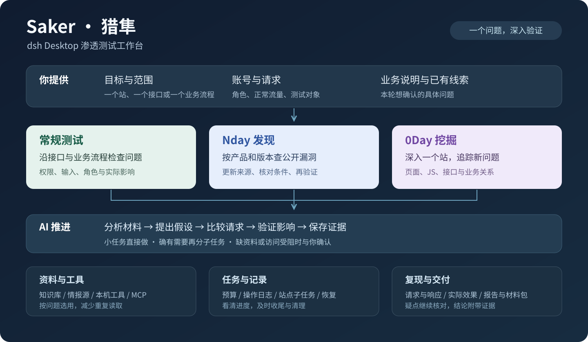

# Saker · 猎隼

基于 [DeepSeek Harness Desktop](https://github.com/deepseek-ai/deepseek-harness) 的渗透测试工作台。你提供目标、账号和已有线索，AI 围绕具体问题查资料、分析请求、验证结果，并整理复现材料。



[下载最新版](https://github.com/ITroyeSivan/Saker/releases/latest) · [安装说明](docs/getting-started.md) · [插件清单](docs/plugin-list.md) · [反馈问题](https://github.com/ITroyeSivan/Saker/issues)

## 三个测试方向

新任务统一从「渗透测试」进入，再选择本轮重点。代码审计、CTF 已退出新任务菜单，历史会话仍可读取。

| 方向 | 适合做什么 | 开始前提供什么 |
|---|---|---|
| 常规测试 | 沿着一个接口或业务流程检查权限、输入和实际影响 | 目标、测试账号、请求样本、你关心的问题 |
| Nday 发现 | 根据产品与版本查已公开漏洞，核对适用条件后验证 | 目标范围、产品线索、版本或已有扫描结果 |
| 0Day 挖掘 | 深入一个站的页面、JS、接口和业务关系，验证新的问题 | 一个站、角色与业务说明、已有疑点或流量 |

例如：**“这个人员查询接口，普通账号能否读取其他部门的数据？”** 把正常请求、两类测试账号和可操作的对象交给 AI，让它沿这条路径比较权限和结果。

只有 URL 时，AI 会先做有限观察，再与你确定方向。相关线索可以连续验证；缺少账号、方向需要调整、IP 被封或正常访问失效时，会停下来说明原因。小任务直接完成，确有需要才分派站点子任务，同站复用，最多两个，结束后回收。

## 工作台能做什么

- **漏洞情报更新**：在设置中选源、保存并后台更新；查看各源进度，失败的源可单独重试。已移除 SRC 范围策略。
- **资料与工具**：本机工具路径、资产平台 API、MCP、知识库、技能和测试方法集中配置。扫描工具按需加载；已有导出结果可以直接导入。
- **站点分析**：整理页面、JS、接口、角色和请求之间的关系，保存材料，减少重复读取与重复请求。
- **过程记录**：查看当前问题、预算、操作记录和子任务，保存中断原因与下一步所需资料。
- **成果交付**：区分疑点与已确认问题，保存正常/异常请求、响应和实际影响，整理复现步骤并导出报告与材料包。

Saker 包含 **24 个独立插件**和一个根包。知识库、MCP、WebShell 管理等功能按需使用，具体配置见[插件清单](docs/plugin-list.md)。外部服务和本机工具需自行安装、启动并配置。

## 安装与启动

当前 Saker **0.4.87** 已在 Windows 官方 Desktop **0.2.0-rc.2** 上验证。请先安装该桌面版本并配置可用模型；其他宿主版本的兼容性尚未验证。

1. 从 [Release](https://github.com/ITroyeSivan/Saker/releases/latest) 下载 `Saker-0.4.87-desktop.zip` 并解压到长期保留的目录。
2. 打开官方 Desktop 完成首次初始化，再完全退出应用。
3. 在解压目录运行下面的命令，将路径换成官方应用的实际安装目录：

```powershell
node scripts/install-desktop.mjs --desktop-dir "C:/实际安装目录/DeepSeek Harness"
```

脚本调用应用自带的官方插件命令，安装并检查全部 25 个包，创建或刷新桌面的 **Saker (dsh Desktop)** 快捷方式。以后双击它启动。更新应用目录时继续使用原来的用户数据目录；请保留解压目录中的 `dist/desktop`，已安装插件会引用其中的文件。

也可在官方「插件」页安装压缩包里的 tgz：先功能插件，最后根包。应用内安装无需另装 Node；脚本安装需要 Node.js ≥22.5。源码打包另外需要 pnpm，见[快速开始](docs/getting-started.md)。

## 实测情况

已完成桌面的任务流程、设置页、插件激活、成果导出和无害 MCP 调用验证；安装后也核对了文件内容与重启后的配置。详见[框架实测](docs/verification/framework-desktop-2026-10-03.md)、[功能复测](docs/verification/desktop-healthcheck-2026-10-04.md)及[本版发布检查](docs/verification/release-0.4.87.md)。

受控对照中，部分任务减少了 token，Nday 任务的用量反而增加。现有测试不能证明真实站点检出率提高，也不保证每个任务更省成本。扫描命中和响应差异仍需验证实际影响。

Saker 自有代码采用 [MIT](LICENSE)；随附资料的许可见 [第三方说明](THIRD_PARTY_NOTICES.md)。
