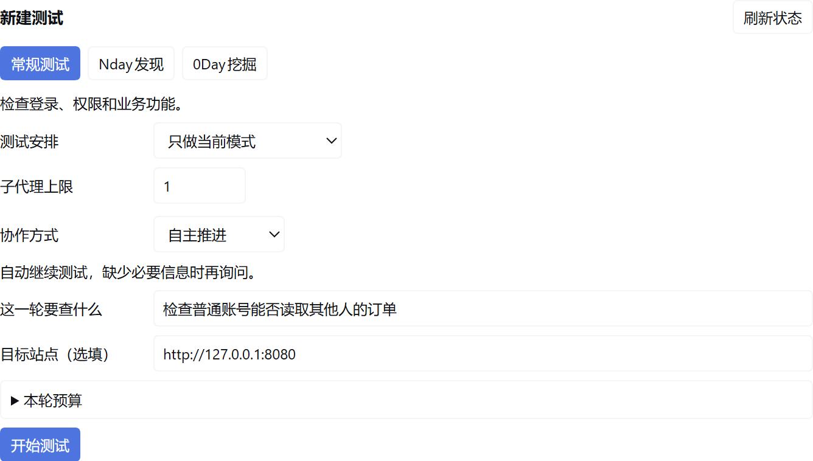
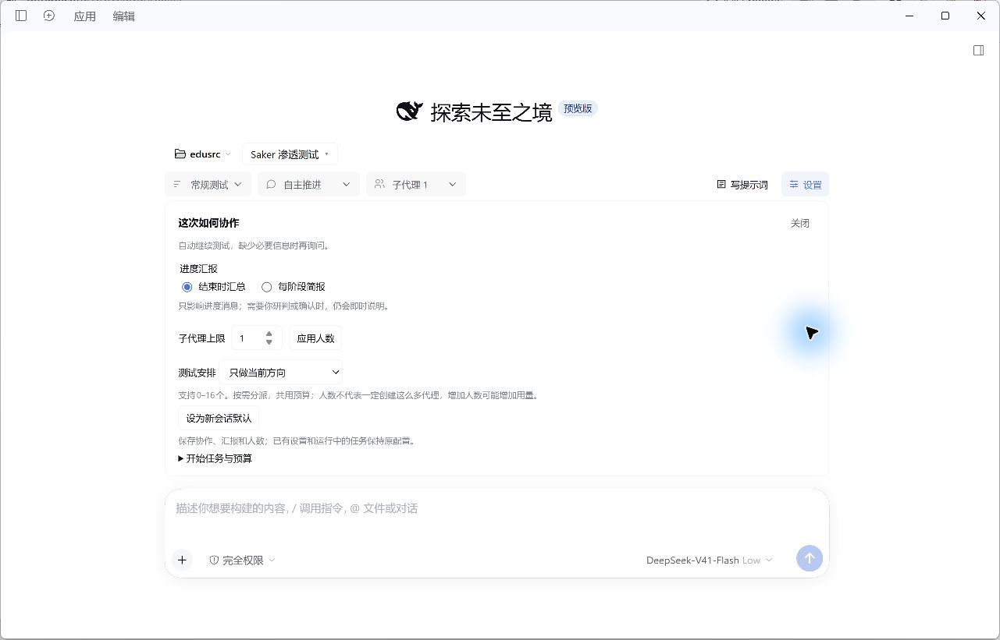
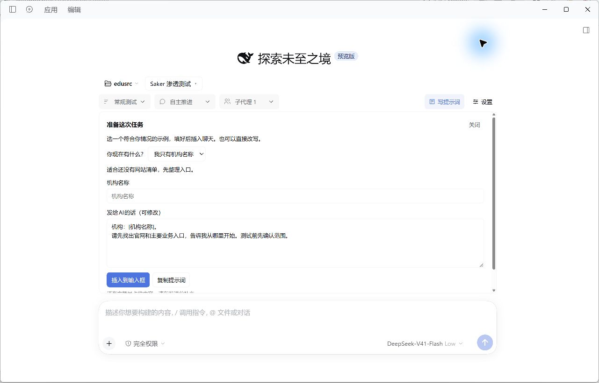
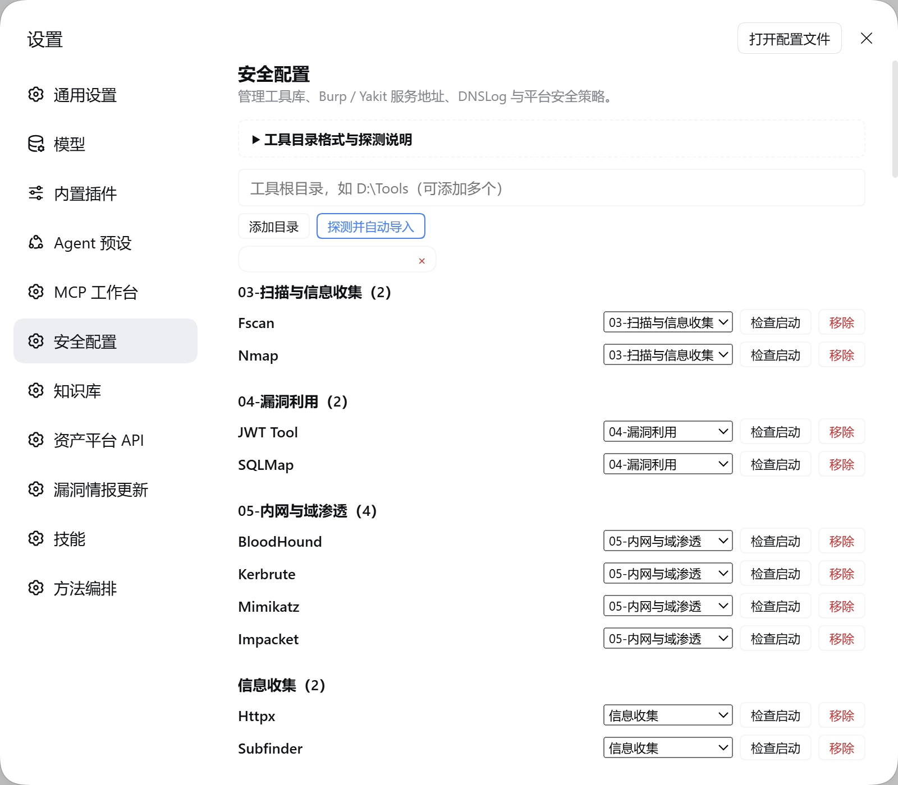
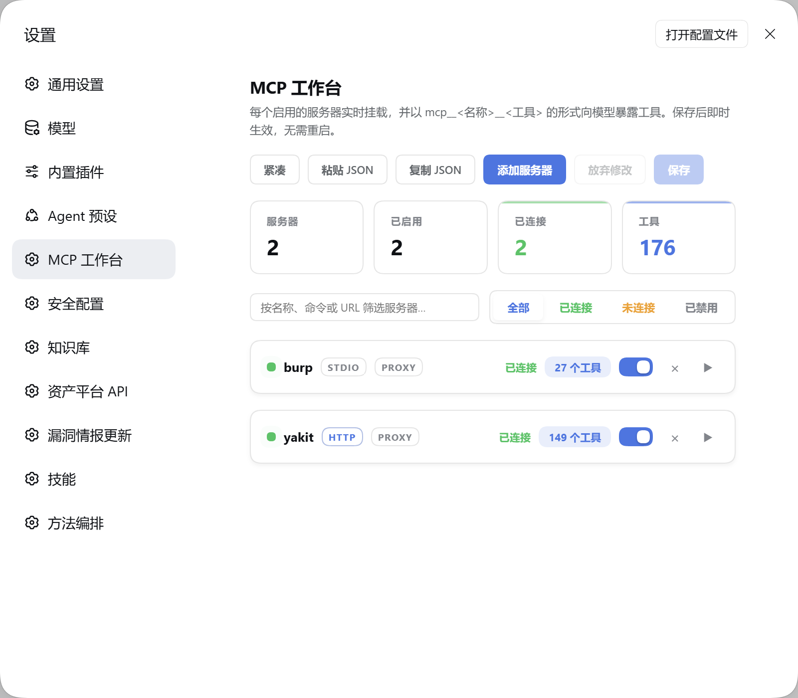
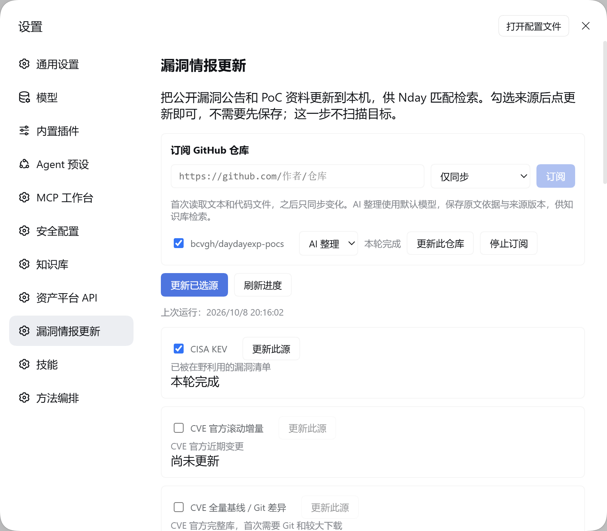
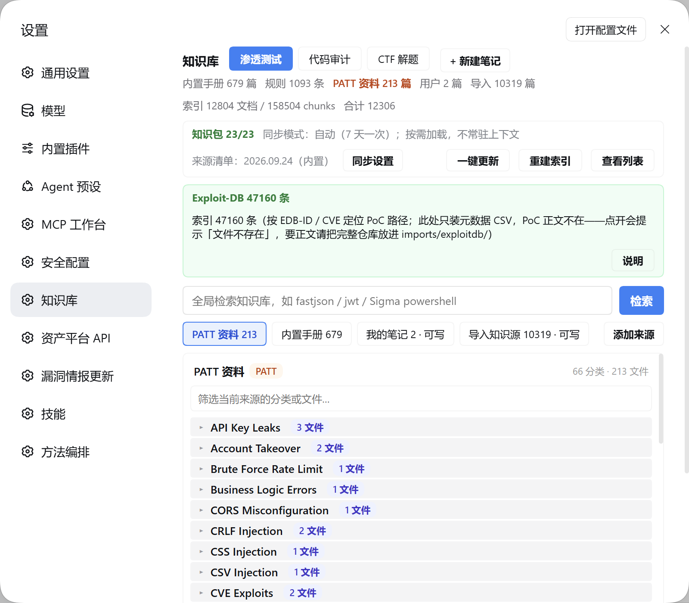
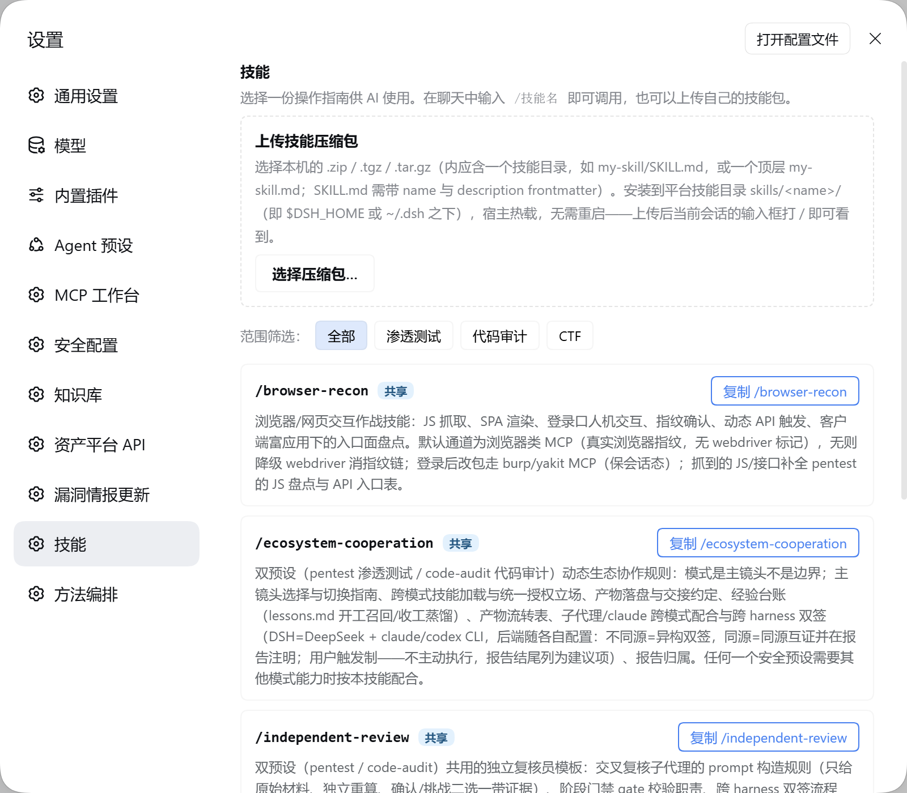
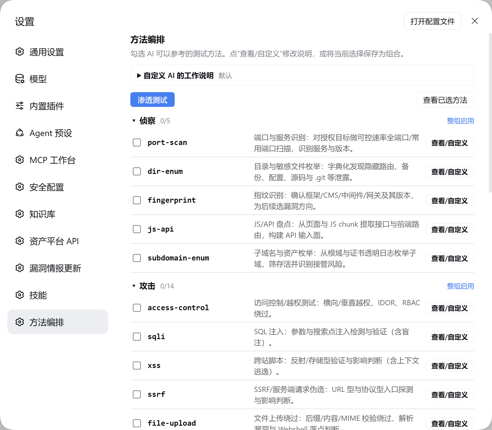

# Saker · 猎隼

Saker（猎隼）是基于 [DeepSeek Harness Desktop](https://github.com/deepseek-ai/deepseek-harness) 的 AI 安全测试工作台，面向个人学习与本地实验。通过一个聊天入口使用常规测试、Nday 发现和 0Day 挖掘，按当前问题调用工具、查阅资料、整理证据。

[下载](https://github.com/ITroyeSivan/Saker/releases/latest) · [安装说明](docs/getting-started.md) · [功能说明](docs/features.md) · [插件清单](docs/plugin-list.md) · [问题反馈](https://github.com/ITroyeSivan/Saker/issues)

## 从一个具体问题开始

新建会话选择「Saker 渗透测试」，说明练习目标、具体问题和允许的操作范围。比如：“检查普通账号能否读取其他人的订单。”三个模式都从同一个聊天入口开始。

| 模式 | 用途 |
|---|---|
| 常规测试 | 检查接口、权限和业务流程中的常见漏洞 |
| Nday 发现 | 查询产品的公开漏洞，核对版本和触发条件 |
| 0Day 挖掘 | 分析页面、JS、请求和业务逻辑，寻找新的漏洞 |

常规测试可以只查当前方向，也可以在收集产品信息后自动接 Nday，或让两者一起推进。任务共用已有资料、操作额度和截止时间，不必重新描述目标。



*入口：聊天框上方「设置 → 开始任务与预算」。图中为未启动的本地练习示例。*

## 你决定参与多少

有时间一起分析，就选「共同研判」；希望在关键步骤再确认，就选「关键节点确认」；希望 AI 按约定自行推进，就选「自主推进」。进度消息可以选每阶段简报或结束时汇总。

子代理上限可设置为 **0–16**。小任务只用主代理；需要并行分析时再分派，同站复用，结束释放。



*入口：聊天框上方的模式、协作、子代理按钮和「设置」，不用离开当前会话。*

## 不知道怎么提问，就从示例改起

选择“我有一个网站”“我有一条请求”等示例，补充手头资料即可。提示词可编辑、插入聊天、复制，也可保存为个人模板。



*入口：聊天框上方「写提示词」。*

## 接入已有工具和 MCP

配置本机扫描、分析工具的路径，检查是否可用，选择启动方式。已有 Burp、Yakit 等 MCP 服务可以继续接入，在工作台查看连接状态、可用工具和调用记录。



*入口：应用设置 → 安全配置。截图中的本机路径已隐藏。*



*入口：应用设置 → MCP 工作台。外部工具与 MCP 服务需要单独安装和配置，截图状态取决于本机环境。*

## Nday 情报持续更新

订阅 GitHub 漏洞仓库和公开漏洞来源，检查新内容与更新记录。AI 可辅助整理产品、版本、触发条件和参考链接，测试时再按目标查找相关候选漏洞。



*入口：应用设置 → 漏洞情报更新。来源更新与目标测试分开进行，可复用已整理的资料。*

## 把资料和自己的笔记放在一起

统一检索内置手册、PATT 资料、个人笔记及导入内容；支持添加 Git 仓库或本机资料，设置同步和重建索引。测试中按需查阅相关内容。



*入口：应用设置 → 知识库。图中数量为示例环境已导入的资料数量。*

## 保存自己的技能和测试方法

技能适合保存一套操作指南，在聊天中用 `/技能名` 调用，也可上传自己的技能包。



*入口：应用设置 → 技能；调用入口：聊天输入框中的 `/`。*

测试方法可单独启用，查看或修改具体说明，再把常用选择保存为组合。



*入口：应用设置 → 方法编排；聊天输入框下方「方法」查看当前选择。*

## 测试之后，能留下什么

会话中的「进度与发现」集中查看本轮在查什么、已确认的问题、待验证的线索以及还缺哪些证据。「发现」查看请求、身份、实际影响和复现步骤，「文件」查找报告及复现材料。

已有请求、流量、JS 和扫描结果也可作为起点，减少重复收集。任务停止后保留资料，后续可以继续核对和补充。

以上图片来自官方 Desktop 界面。更多操作见 [功能说明](docs/features.md)。

## 安装

当前版本 **0.4.103**，适用于官方 Windows Desktop **0.2.0-rc.2**。

1. 安装官方 Desktop，完成初始化和模型配置，然后完全退出应用。
2. 从 [Releases](https://github.com/ITroyeSivan/Saker/releases/latest) 下载桌面安装包，解压到长期保留的目录。
3. 在解压目录执行，将路径替换为 Desktop 的安装目录：

```powershell
node scripts/install-desktop.mjs --desktop-dir "C:/path/to/DeepSeek Harness"
```

安装器检查全部 22 个包，并创建或刷新桌面的 **Saker (dsh Desktop)** 快捷方式。双击快捷方式启动；更新沿用原来的用户数据与 MCP 配置。请保留解压目录中的 `dist/desktop`。脚本需要 Node.js ≥22.5。

## 项目状态

项目目前处于快速迭代阶段，暂不建议正式使用，仅限个人学习与本地实验。请在自行搭建或明确获授权的环境中使用。

Saker 自有代码采用 [MIT](LICENSE)，随附资料许可见 [第三方说明](THIRD_PARTY_NOTICES.md)。源码构建及贡献方式见 [开发说明](docs/development.md)。
