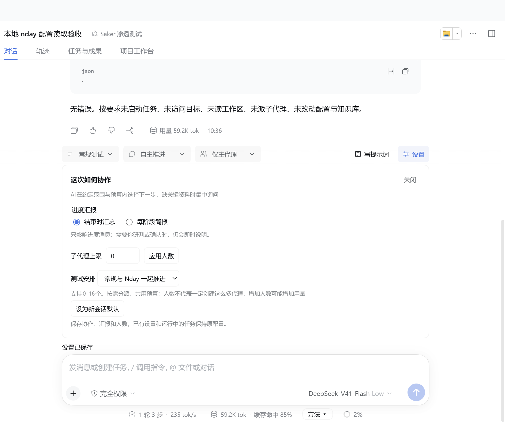

# Saker · 猎隼

Saker 是 [DeepSeek Harness Desktop](https://github.com/deepseek-ai/deepseek-harness) 的安全测试插件集，包含常规测试、Nday 发现、0Day 挖掘，以及工具管理、MCP、漏洞情报和知识库。



[查看单张截图](docs/images/desktop-screenshots-2026-10-04.md)

[下载](https://github.com/ITroyeSivan/Saker/releases/latest) · [安装说明](docs/getting-started.md) · [插件清单](docs/plugin-list.md) · [问题反馈](https://github.com/ITroyeSivan/Saker/issues)

## 测试模式

新建会话选择「Saker 渗透测试」，支持以下三种模式：

| 模式 | 用途 |
|---|---|
| 常规测试 | 检查接口、权限和业务流程中的常见漏洞 |
| Nday 发现 | 查询产品的已公开漏洞，检查版本和触发条件 |
| 0Day 挖掘 | 分析页面、JS、请求和业务逻辑，查找新的漏洞 |

支持导入请求、流量、JS和已有扫描结果。测试过程中保存分析记录、复现步骤和证据；遇到封禁、账号失效等阻碍会停止并说明原因。子代理上限支持0–16，按需创建、同站复用，结束后释放。

聊天输入框上方直接选择共同研判、关键节点确认或自主推进；进度汇报单独设置。紧凑入口保持常驻，提示词可选示例、填空、自由编辑、插入或复制，个人模板跨会话复用。共同研判时可在等待节点补充业务怀疑，再按这个思路继续。常规与Nday安排在「设置」中，两方向共用资料、操作额度和截止时间。[查看设计依据与实际截图](docs/chat-cooperation-design-2026-10-07.md)。

代码审计和 CTF 不再作为独立模式，历史会话仍可查看。

## 功能

- **工具管理**：配置本机工具路径，按需调用扫描和分析工具。
- **MCP 工作台**：管理 MCP 服务，查看连接状态、工具列表和调用日志。
- **漏洞情报**：选择数据源并更新，查看各源进度，单独重试失败的源。
- **知识库**：随包提供安全资料，支持检索和导入资料。
- **技能与方法**：编辑技能、提示词和测试方法，调整调用顺序。
- **任务与成果**：查看任务进度、操作记录和子任务，保存漏洞证据，导出报告及附件。

共 21 个功能插件和一个根包，可按需安装。外部工具及 MCP 服务需要单独安装、配置和启动，见[插件清单](docs/plugin-list.md)。

AttackAtlas、战役记忆和 WebShell 管理已退出运行包；hunter 聊天页移除，资产平台与漏洞情报设置保留。升级安装器通过官方命令卸载旧模块，历史数据库保留。实施进度与 Nday 验收边界见[统一实施清单](docs/saker-consolidated-delivery-2026-10-09.md)。

## 安装

当前版本 **0.4.97**，已在 Windows 的官方 Desktop **0.2.0-rc.2** 上测试。其他宿主版本尚未验证。

1. 安装官方 Desktop，完成首次初始化并配置模型，然后完全退出应用。
2. 下载 [Saker-0.4.97-desktop.zip](https://github.com/ITroyeSivan/Saker/releases/download/v0.4.97/Saker-0.4.97-desktop.zip)，解压到长期保留的目录。
3. 在解压目录执行，将路径替换为 Desktop 的实际安装目录：

```powershell
node scripts/install-desktop.mjs --desktop-dir "C:/实际安装目录/DeepSeek Harness"
```

安装脚本会检查全部 22 个包，并创建或刷新桌面的 **Saker (dsh Desktop)** 快捷方式。安装后双击快捷方式启动；更新时沿用原来的用户数据目录。

请保留解压目录中的 `dist/desktop`，已安装插件会引用其中的文件。脚本需要 Node.js ≥22.5；也可在应用的「插件」页手动安装 tgz，先安装功能插件，最后安装根包。源码构建步骤见[安装说明](docs/getting-started.md)。

## 测试记录

本轮加入前置任务、产物条件和执行租约，修复 Desktop 工作台和任务工具接入，实际结果见[依赖任务验收](docs/verification/task-dependencies-2026-10-08/README.md)。完整改进目标与未完成项见[实施进度](docs/saker-implementation-progress-2026-10-08.md)。此前记录：[简短示例验收](docs/verification/simple-prompts-2026-10-08.md)、[协作设置验收](docs/verification/chat-cooperation-2026-10-07.md)、[框架测试](docs/verification/framework-desktop-2026-10-03.md)、[功能复测](docs/verification/desktop-healthcheck-2026-10-04.md)。

目前的测试不能证明真实目标的漏洞检出率提高。Token 用量随任务变化，Nday 对照测试中用量有所增加。

Saker 自有代码采用 [MIT](LICENSE)，随附资料的许可见[第三方说明](THIRD_PARTY_NOTICES.md)。
