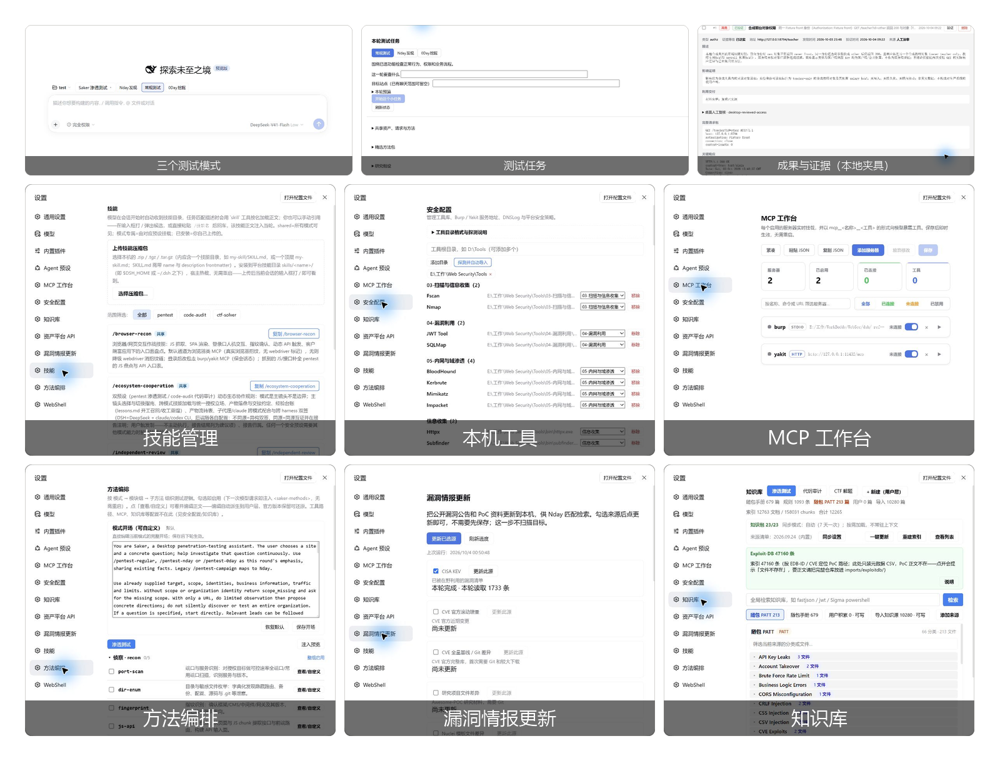

<div align="center">

# Saker

**给 DeepSeek Harness 用的安全测试工作台：授权渗透测试、代码审计与 CTF 解题的流程、工具、留痕都可替换。**

模块化提示词 · 24 个独立插件 · 自定义工具链 · MCP 接入 · 安全知识库 · WebShell 管理

[](https://github.com/deepseek-ai/deepseek-harness)
[](https://github.com/ITroyeSivan/Saker)
[](./package.json)
[](./LICENSE)

</div>



## 这是什么

Saker 是 DeepSeek Harness 上的一套安全测试模式包，外加 24 个独立插件。
渗透测试以快速信息收集、匹配最新 Nday、必要时开展 0day 挖掘为主线，目标止于可复核的 RCE；不把大范围扫描或后渗透作为默认步骤。

跟常见的「AI 渗透测试插件」不同，那些本质是一段写死的提示词——流程、话术、输出格式、工具选择全固化在文本里，装上去是什么样，用起来就永远是什么样。
Saker 把这些都做成能自己改的：内置提示词能自由组合、自由修改，工具和 MCP 接哪个由你定，技能可以自己装，模式包（persona / playbook）也能整套换掉。

## 特性

- **渗透测试四种组合** — 常规测试、Nday 发现、机构 FOFA Nday、0day 挖掘；按目标类型选择，CTF 不占默认入口
- **提示词可编排** — 内置提示词能勾选、改内容、存成组合，输入框「方法 ▾」一键切
- **技能可自定义** — 技能包能上传安装、能卸载，会话里按需引用
- **工具可自定义** — 本机扫描器的路径和分类自己配，库里没有的工具也能加进来
- **MCP 可接入** — stdio 和 streamable HTTP 两种接法，连上就能给模型用
- **机构 FOFA Nday** — 用 ICP、域名、机构名称、证书和 Nday 指纹组合检索；IP-only 主机保留为被动候选，未落入精确范围前不进入主动筛查
- **Nday 优先** — 按产品与版本识别候选公告，来源覆盖厂商、CVE、CNVD、CNNVD 与 AVD；命中后再查利用资料，不预先收集整库 PoC
- **扫描按需加载** — Nmap、目录探测、Nuclei 等扫描工具由当前会话按需启用，不在每个新会话默认铺开
- **攻击面覆盖** — 资产、指纹、测试进度与证据可落库复核
- **WebShell 管理** — 16 种载荷生成、连接与文件/数据库操作，库按语言和绕过方式分类
- **知识库自动扩展** — 20 个高质量知识包、SQLite FTS5 混合检索、PayloadsAllTheThings 与 Exploit-DB，离线可用
- **成果与证据** — 每个发现都挂证据和复核状态，报告从台账生成，不是模型现场编
- **跨会话记忆** — 打过的目标、指纹、工具经验都留着，下个会话能查

## 快速开始

### 环境要求

- DeepSeek Harness 已安装，`dsh web` 能正常启动，并已配置可用模型
- Node.js `>= 22.5`（MCP Studio 要求 `^22.19.0 || >= 24.0.0`）
- 用扫描器、Semgrep、Burp、Yakit时，需自行安装并配置

### 安装

```bash
git clone https://github.com/ITroyeSivan/Saker.git
cd Saker

node scripts/pack-all.mjs        # 生成根模式包和 24 个插件包
node scripts/install-all.mjs     # 装进 dsh 的 web profile
dsh web                          # 重启宿主
```

`install-all.mjs` 会跳过已是最新的包、升级更高版本，可安全重复执行。

### 确认装好了

进入「设置」，依次点开安全配置 / MCP 工作台 / 知识库 / 技能 / 方法编排 / WebShell，六个面板都应正常加载。
新建渗透测试会话后，从「方法 ▾」选择常规、Nday、机构 FOFA Nday 或 0day 组合；扫描工具需在任务需要时再加载。

工具探测、MCP 地址、DNSLog 等首次配置见 [安装与首次配置](./docs/getting-started.md)。

当前版本支持 DeepSeek Harness `0.1.7-rc.2`，`0.1.6-alpha.1` 保留兼容。发布内容与验证结果见[本版更新日志](./docs/release-v0.4.59.md)。

| 你想做什么 | 看哪篇 |
|---|---|
| 装起来、跑通第一个任务 | [安装与首次配置](./docs/getting-started.md) |
| 搞清楚每个功能在哪、怎么改成自己的 | [功能说明](./docs/features.md) |
| 了解整体设计与插件分工 | [架构：它是怎么搭起来的](./docs/architecture.md) |
| 查某个插件是干什么的 | [插件清单](./docs/plugin-list.md) |
| 判断能力该用 dsh 宿主还是 Saker | [宿主能力对照](./docs/host-capabilities.md) |
| 改代码、打包、发版 | [开发与发布](./docs/development.md) |
| 确认能用在哪、哪些结论要人复核 | [边界与执行约束](./docs/boundaries.md) |
| 看这一版改了什么 | [发布说明](./docs/release-v0.4.59.md) |

## 执行范围

渗透测试模式围绕目标发现与可复核 RCE；RCE 确认后停止，不继续内网、提权、驻留或横向活动。
被动测绘结果与产品指纹是候选线索，需结合版本、前置条件和请求响应证据判定。

本地配置与任务产物可能含 API Key、Token、请求报文和源码，公开日志或截图前务必脱敏，不要提交个人的 `.dsh` 目录。

## 反馈与许可

- Bug、功能建议、用法疑问：[GitHub Issues](https://github.com/ITroyeSivan/Saker/issues)（请附 dsh 版本、Saker 版本和复现步骤）
- 作者：[@ITroyeSivan](https://github.com/ITroyeSivan)
- 项目仍在快速迭代，会不定时适配 DSH 最新版本、修问题、优化性能

Saker 自有代码采用 [MIT License](./LICENSE)。随附第三方资料不自动转为 MIT，再分发前请读 [THIRD_PARTY_NOTICES.md](./THIRD_PARTY_NOTICES.md)。

致谢 [DeepSeek Harness](https://github.com/deepseek-ai/deepseek-harness)、[dsh-pentest](https://github.com/howmp/dsh-pentest)、[ARTEX](https://github.com/Autumn-27/ARTEX)，以及所有被引用的知识资料、检测规则与安全工具的维护者。
