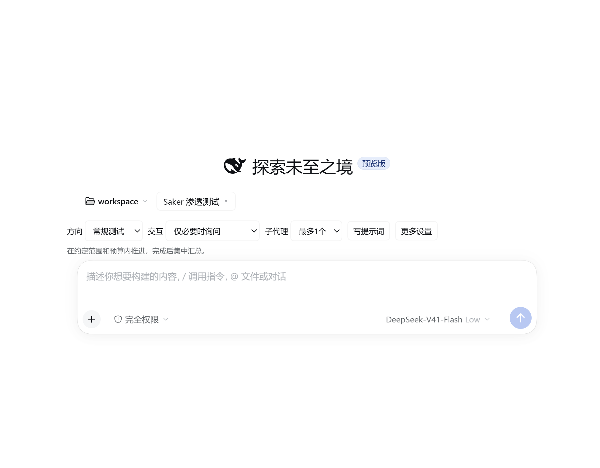
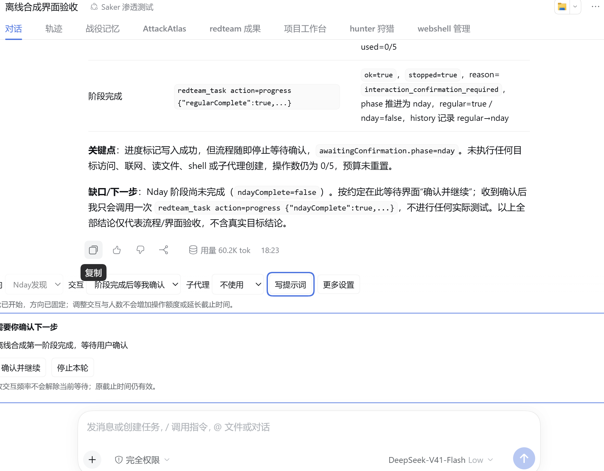
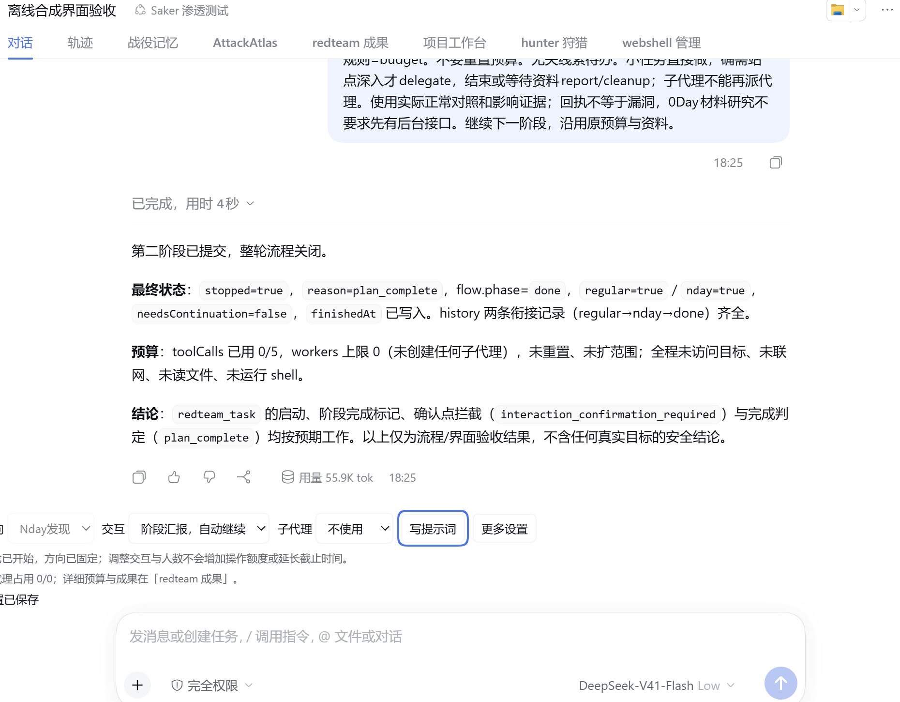

# 聊天设置 Desktop 验收

版本：Saker 0.4.89，成果插件 1.0.40，模式入口 1.0.6；官方 dsh Desktop 0.2.0-rc.2。使用原日常 home 和 Desktop 用户数据，验证工作区为独立的离线合成目录。没有登录操作。

## 实际结果

| 场景 | 结果 |
|---|---|
| 空白会话与已有聊天 | 输入框上方均显示方向、交互、人数、写提示词；开始聊天后入口保持 |
| 提示词填空 | 目标及范围填写后实际全文更新；自由编辑后直接使用编辑内容 |
| 复制 | 九个不同示例逐项复制核对，按 Windows CRLF/LF 规则归一化后与编辑内容一致 |
| 复制失败 | 临时模拟剪贴板写失败，出现手工复制提示，全文仍可编辑；随后恢复剪贴板方法 |
| 插入 | 宿主输入框实际保留原草稿并插入编辑内容；此前模型调用和工具调用均为0，任务未开始 |
| 刷新 | 选择的流程、频率、人数、编辑草稿及输入框内容实际恢复 |
| 个人模板与默认 | 第一个会话保存，实际第二个独立会话能选用模板，并采用保存的频率和人数；没有自动开始任务 |
| 阶段确认 | 真实模型完成离线合成第一阶段后停止；聊天中出现确认与停止按钮 |
| 等待中改设置 | 改为阶段汇报并将人数0→2→0后，仍保持原等待；没有自行续接 |
| 确认继续 | 点击聊天确认按钮后真实模型完成Nday阶段；原操作数、额度和截止时间不变 |
| 键盘 | 实际 Escape 关闭编辑区，焦点返回「写提示词」 |
| 最终版本初始化 | 全局默认恢复后，独立新会话实际保存常规、仅必要时询问、最多1个；没有启动任务 |
| 快速切换方向 | 实际常规→Nday→常规，两个方向的自由编辑草稿分别保存并恢复 |
| 下一轮 | 在实际完成的会话点击聊天按钮，上一轮归档保留预算，历史回复仍在，沿用交互和人数，没有自动调用模型 |
| 设置拒绝提示 | 注入一次合成设置拒绝，其余读取使用实际端点；定时刷新后错误仍显示，原人数不变，随后恢复 fetch |
| 插件激活 | 最终安装后详情显示 Saker 0.4.89 的2个组件运行中，成果1.0.40与模式1.0.6各1个运行中 |
| 桌面快捷方式 | 已刷新 Windows 实际桌面的入口并直接启动；沿用日常 home 和用户数据，原生界面显示新设置，无登录要求或可见错误 |
| MCP | burp、yakit 在且启用；连接0、工具0，桥接程序与两个原地址保持。未验证其业务调用 |

原生 Desktop UI 与其调试接口共同用于操作和读取实际结果；没有把浏览器页面、单测或安装文件比较当作 Desktop 运行证据。截图裁去用户会话侧栏，记录只保留合成资料。

## 可复核记录

- [提示词准备与零调用](chat-setup-2026-10-07/prompt-proof.json)
- [九个复制示例](chat-setup-2026-10-07/copy-proof.json)
- [刷新恢复](chat-setup-2026-10-07/reload-proof.json)
- [跨会话默认与模板](chat-setup-2026-10-07/defaults-proof.json)
- [等待状态](chat-setup-2026-10-07/wait-state.json)、[改设置后仍等待](chat-setup-2026-10-07/before-confirm.json)、[实际完成](chat-setup-2026-10-07/complete-state.json)
- [MCP 实际状态](chat-setup-2026-10-07/mcp-proof.json)
- [反向验证](chat-setup-2026-10-07/reverse-proof.json)
- [最终安装的桌面验证](chat-setup-2026-10-07/final-desktop-proof.json)
- [实际桌面快捷方式启动](chat-setup-2026-10-07/shortcut-proof.json)
- [完整回归](chat-setup-2026-10-07/regression.txt)

完整回归：81套，13,555通过、0失败、16跳过。安装同步：24个插件、2,310个文件与源码一致。跳过项仍为15项未提供的上游模式/资料和1项本机未安装PHP，检查阈值没有放宽。

回归覆盖：用户偏好进入实际系统提示词；运行中改频率/人数不重置操作额度和截止时间；占用名额时降低人数被拒且页面保留错误提示；未确认的阶段不能开启新一轮；新会话默认不修改已有任务；草稿按会话与方向隔离，延迟的旧保存不能覆盖新编辑。反向验证临时去掉方向隔离，相关断言实际失败，之后恢复源码。

本轮模型验收仅使用离线合成任务，证明界面和任务续接行为；没有据此推导真实目标的漏洞检出率或模型成本改善。MCP 配置保留以实际设置页为证，不宣称整份配置文件哈希不变。
