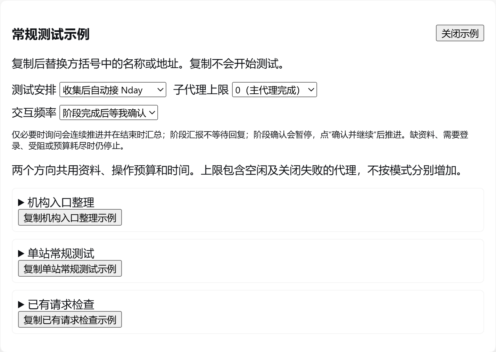

# Saker 0.4.88 发布检查

2026-10-07，Windows 官方 DeepSeek Harness Desktop 0.2.0-rc.2；模型使用 DeepSeek-V41-Flash / Low。成果插件 1.0.39。

## 回归与安装

| 检查 | 结果 |
|---|---|
| 完整回归 | 81 套，13,549 通过、0 失败、16 跳过 |
| 工具描述预算 | 成果插件 93 条描述、5,930 字节，低于原 6,000 字节阈值 |
| 配置目录与前端纪律 | 11 通过 |
| 安装失败回滚 | 27 通过 |
| 文档插件清单 | 24 个独立插件，版本与源码一致 |
| 打包与官方安装 | 25 个包成功，安装器验证文件内容 |
| 实际 Desktop profile 同步 | 24 个插件、2,309 个文件，与源码字节一致 |

16 项跳过：15 项依赖本发行版未提供的上游模式或资料，1 项需要本机 PHP。[完整回归](release-0.4.88/regression.txt)、[回滚检查](release-0.4.88/rollback.txt)。

反向验证分别恢复旧工具过滤器、删除阶段确认设置：续接测试和交互测试均失败，随后还原源码并重跑通过。没有放宽预算阈值或忽略打包一致性检查。

## 交互频率的实际行为

三个模式均可选择交互频率，选择立即持久化。默认仅必要时询问；阶段汇报会继续推进；阶段确认会停在服务端等待状态。

实际刷新 Desktop 渲染器后，常规后接 Nday、零子代理、阶段确认三个选择全部保留；选择本身的模型调用与工具调用均为零。[刷新后状态](release-0.4.88/choice-after-reload.json)。

真实模型完成资料整理后，状态为 `interaction_confirmation_required`，Nday 尚未完成，未自动续接。改为阶段汇报后仍等待已有确认；在成果页实际点击「确认并继续」，模型读回原资料并完成 Nday。开始时间、截止时间、操作额度和已用计数保持原值。[等待状态](release-0.4.88/interaction-wait.json)、[确认后完成状态](release-0.4.88/interaction-complete.json)。

最终安装版另测 0Day 单模式：模型调用 `checkpoint` 后服务端等待确认，界面同时提供「确认并继续」「停止本轮与子代理」，不会把阶段等待当成可重开预算的已结束任务。实际点击停止后取消状态保存，等待标记解除。[单模式状态](release-0.4.88/single-confirm-status.json)。

从官方会话日志的 `system/message` 检查到三种频率及必须停止的条件进入真实系统提示词；确认按钮投递的消息进入宿主收件箱。发布证据只保留标记、计数、工具名和动作，不包含完整系统提示词、请求包或工作区历史内容。[精简会话证据](release-0.4.88/session-events.json)。

阶段确认不暂停时间预算，不自动延长截止时间；确认和改频率均不能恢复已取消、受阻或额度耗尽的任务。连续推进和阶段汇报的日常提问节奏由模型执行，不能据此保证任意任务都不会出现额外交互。

## 示例、衔接与子任务

- 常规、Nday、0Day 各三个示例，九次真实复制均与文本一致；Windows 换行归一化后粘贴一致。复制不启动任务。临时模拟剪贴板拒绝后出现明确手工复制提示，随后恢复剪贴板接口。[复制检查](release-0.4.88/copy-checks.json)、[Nday 界面](release-0.4.88/desktop-nday-examples.png)、[0Day 界面](release-0.4.88/desktop-0day-examples.png)。
- 顺序流程使用安装版生产策略接口预置合成资产及一次预算预留；真实模型回合停止后，宿主投递自动衔接消息并接着完成 Nday，原截止时间及已用次数保留。[自动衔接状态](release-0.4.88/handoff-status.json)。预留只调用预算守卫，没有向占位目标发送请求。
- 并行流程由主代理交替推进，两方向各自完成，原 5 次操作预算、10 分钟截止时间及零子代理设置保留。[并行状态](release-0.4.88/parallel-status.json)。
- 同站子任务在常规结束后释放，Nday 继续复用原 childId，第二次回报后再释放，最终 active=0。真实子会话调用 `nday_policy_get`，其工具快照包含 Nday 工具和 `tool_pack`，没有嵌套分派。[最终子任务状态](release-0.4.88/worker-complete.json)。
- 首次桌面测试暴露延迟工具包缺口：若首次分派时 Nday 未加载，事后在主会话加载无法补齐原子会话过滤器。修复后实际拒绝未加载的首次分派，加载后成功；子会话可以加载原清单准许的本地 Nday 工具。首次缺口保留在[原状态](release-0.4.88/worker-first-status.json)，没有将其列为成功。
- 实际点击 Desktop 停止按钮，取消保存且活动子任务为零。另以安装版生产接口构造离线受阻与预算耗尽状态，真实模型读取状态并结束，宿主没有自动续接。[取消](release-0.4.88/cancel-status.json)、[受阻](release-0.4.88/blocked-status.json)、[额度耗尽](release-0.4.88/exhausted-status.json)。这些是离线状态夹具，不是实际封禁或真实目标请求的检测效果。

最初的自动衔接测试在原有工作区运行，模型额外读取了历史材料。后续验收移到独立合成工作区，未把这些历史内容写入发布证据。模型报告中的工具次数或完成措辞可能与真实状态不同，结论以生产状态和官方事件为依据。

## 最终桌面与配置

根包显示 0.4.88、2/2 组件运行；成果插件显示 1.0.39、1/1 运行。[根包](release-0.4.88/desktop-root-version.png)、[成果插件](release-0.4.88/desktop-results-version.png)。设置和任务面板加载正常，未见激活错误或未处理前端异常。[错误检查](release-0.4.88/desktop-errors.json)。本轮没有登录操作或登录阻碍。

MCP 设置中 Burp、Yakit 两份配置仍在且启用，实际地址、桥接程序与安装前检查相符；服务未连接，工具为零，没有测试其业务工具。[实际 MCP 设置](release-0.4.88/desktop-mcp.png)。整个 profile 文件的 SHA-256 在安装/激活过程中改变，不能宣称全配置文件字节未变；配置保留依据实际 MCP 界面检查。[配置检查记录](release-0.4.88/settings-integrity.json)。

安装器刷新实际 Windows 桌面的「Saker (dsh Desktop)」稳定快捷方式。实际从该快捷方式启动官方应用，未启用调试端口，三模式与示例入口加载，恢复原日常工作区；用户数据目录和启动配置沿用原设置。[快捷方式目标](release-0.4.88/shortcut.json)、[实际启动](release-0.4.88/shortcut-launch.json)。

独立验收工作区已通过 Desktop 移除注册，会话证据保留。清理仅处理本轮进程和临时文件，临时目录使用工作区 `_ref/tmp`。

## 发布范围与限制

桌面 ZIP 包含 25 个 tgz、安装器、校验清单、文档及 README 引用的截图。安装包不包含用户配置、登录资料、会话数据库或依赖目录。

基线为 Windows Desktop 0.2.0-rc.2。官方安装命令仍有既有 peer dependency 范围告警，未使用兼容性豁免。其他宿主版本、外部服务的业务工具和真实目标检出率未由本轮验证。多个 Low 回合仍消耗较多上下文，尤其包含缓存读取；本轮不是节省 token 的对照实验。
